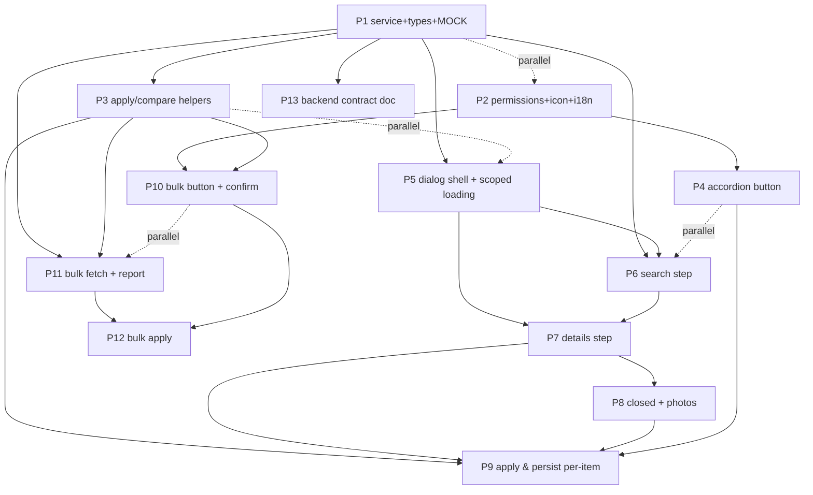

# Places API (New) — Edit Destination Integration — Implementation Plan

> **Feature:** Integrate the **edit destination** page with the Google **Places API (New)**.
> **Scope (this plan):** Frontend only — build the call layer, the multi-step UI, and the apply/edit logic.
> **Backend:** Cloudflare routes (all validation lives there; the client only sends `uid` + `lang`). Routes are **not built yet** → the frontend uses **placeholders + a MOCK mode** so the whole feature is buildable and demoable now.

---

## 1. Feature Summary (from the spec)

1. **Per-item "Fetch Info With Maps"** button inside each destination accordion (top-right), icon `simple-icons:googlemaps`.
2. Clicking it opens a **multi-step dialog**:
   - **Step 1 — Search:** search bar backed by the *search* route. If the entry already has a name, pre-fill `${name} {destinationName}` (destinationName = the destination doc `title`). No auto-search — user presses Search. Up to 5 results; selecting one advances.
   - **Step 2 — Details:** shows the place's main data as **disabled inputs**, each with an **"Update with this info"** checkbox (checked by default). Only checked fields get applied. Description arrives **only in the requested language**.
   - **Step 3 (conditional) — Photos:** if the user opted to import photos ("photos can be imported"), call the *photos* route for the first 3 photo references and put them in the entry's images.
   - **Closed place:** if the API says the place is no longer operational, notify the user and offer: **delete the item**, **ignore**, or **add a `[Closed]` label** to the title (translatable). Otherwise continue the normal flow.
   - **Loading:** while fetching, show the **same preloader animation but scoped inside the dialog** (not full screen), with a close (X) to cancel.
3. **Persistence rule:** regardless of which fields are replaced, the fetched info is **always saved to the entry's `placeAPI` object**. Fields the user marked → also **override the destination item** values.
4. **Bulk "Update with Maps"** button on the main edit screen, visible when **at least one entry has a place ID**. Opens a dialog: "will try to get info from X linked items" → confirm → loading → for each linked item, fetch + compare against saved `placeAPI` → **report** (X fields can be updated, Y places no longer operational) with options:
   - **Fields:** *replace everything* with new data, OR *replace only the auto-filled fields* (compare destination data ↔ old place data ↔ new place data).
   - **Closed places:** *auto-delete* the items, OR add a `[Closed]` label to the title.
   > **No photos in bulk:** the bulk flow only calls the *info* route per place ID — it **never** calls the photos route. Photo import exists **only** in the per-item dialog (Step 3).

---

## 2. Key Facts & Constraints (grounded in the codebase)

| Area | Current state |
|---|---|
| Edit page | `public/edit/destination.html`; logic in `public/assets/ts/pages/edit-destination/` (`new-destination.ts`, `existing-destination.ts`, `set-destination.ts`, `edit-destination.ts`, `support/event-listeners.ts`, `categories/`). |
| Entry accordion (edit) | Built in `new-destination.ts` (`addRestaurants/addSnacks/addNightlife/addTourism/addShopping`). Header is `#<category>-<j>` → `.accordion-header` → a single `accordion-button` (a `<button>`) containing `.flex-button-inner` with `.title-text` + `.icon-container`. |
| Entry schema | `PlaceItem` in `models/new-schema.ts` — `name, description, rating, price, map, website, region, instagram, isNew, createdAt, media, emoji, images`. |
| `placeAPI` object | Added by **migration 17** (subset of the python script output): `region, name, website, rating, price, description, emoji, map, updatedAt, instagram, id`. `id` = Google Place ID. |
| Form → object | `set-destination.ts` `buildDestinationObject()` / `buildDestinationCategoryObject(category)` reads each `#<category>-<field>-<j>` into the item. Saving happens through the edit page save flow (`setDocument`, `updateDestination`). |
| Modal system | `utils/messages.ts` — `displayFullMessage(properties)`, `displayMessage`, `closeMessage()`, `MESSAGE_PROPERTIES` (`title, content, fullscreen, closeButton, buttons, containers, icons`), `getContainersInput()`. Example: `categories/description.ts` `openDescriptionModal()`. Standardized dialog animations (`animateDialogOpen/Close`). |
| Full-screen loader | `utils/loading.ts` `startLoadingScreen()/stopLoadingScreen()` using `#preloader`. Spinner animation lives in `public/assets/css/base/preloader.css` (`animate-preloader`). |
| HTTP | Plain `fetch()` (see `app/config.ts` `loadJSON`, TikTok oembed in `set-destination.ts`, currency API). No axios. |
| Permissions | `data/firebase/database.ts` `getPermissions()` currently checks `['unlimitedUploadSize','upload']`; **`canUsePlacesAPI` is not read yet** (docs say it exists in DB + `initLocalDb` grants it). |
| i18n | `i18n/translation.ts` `translate(key)`; language packs `public/assets/json/languages/{en,pt}.json`; `LANGUAGES = ['en','pt']`; `getUserLanguage()`, `getLanguagePackName()`; static `data-translate` via `translatePage()`. |
| Icons | Iconify via `<i class="iconify" data-icon="...">`. Icon helper in `theme/icons.ts` (`getNewSvg`). |
| Action wiring | `ui/actions.ts` — `registerActions({...})` + `data-action="name"` attributes (delegated click). Use this for new buttons. |

**Important structural gotcha:** the per-item "Fetch Info With Maps" button must NOT be nested inside the existing `accordion-button` (a `<button>` inside a `<button>` is invalid). Add it as a **sibling** of the toggle button inside `.accordion-header` (or restructure), using `data-action` + `data-stop-propagation`.

---

## 3. Contracts (placeholders — confirm against real Cloudflare routes)

> **✅ Prompt 13 (done):** The **finalized backend contract** now lives in
> [`docs/ai-analysis/7-places-api-backend-contract.md`](7-places-api-backend-contract.md)
> — exact request/response JSON, `businessStatus` handling, photo reference format,
> and the auth/uid/lang contract for the Cloudflare worker. The summary below is kept
> in sync as a quick reference; the contract doc is the source of truth.

Placeholder base URL constant (single place to change when routes are ready):

```ts
// data/services/places-api.service.ts
export const PLACES_API_BASE_URL = 'https://PLACEHOLDER.api.tripviewer.dev'; // TODO: real Cloudflare URL
export const PLACES_API_MOCK = true; // TODO: set false when routes ship
```

All routes receive `uid` (from `getUID()`) and `lang` (`en` | `pt`, from `getLanguagePackName()`). Cloudflare validates origin + user server-side.

| # | Route (placeholder) | Purpose | Request → Response (proposed) |
|---|---|---|---|
| 1 | `GET {base}/places/search` | Name search, ≤ 5 results with all needed data | `?q=<text>&uid=<uid>&lang=<lang>` → `{ results: PlaceResult[] }` |
| 2 | `GET {base}/places/{placeId}` | Full place info by Google Place ID | `?uid=<uid>&lang=<lang>` → `{ place: PlaceDetails }` |
| 3 | `GET {base}/places/{placeId}/photos` | Photo URLs for the first 3 photos | `?uid=<uid>&lang=<lang>` → `{ photos: PlacePhoto[] }` |

**Shape proposal (types live in `models/places-api.model.ts`):**

```ts
interface PlaceSearchResult {      // route 1 item
  id: string;                      // Google Place ID
  name: string;
  description?: string;            // localized (requested lang only)
  region?: string;
  website?: string;
  instagram?: string;
  rating?: string;                 // e.g. "4" (rounded, like the python script)
  price?: string;                  // "$" | "$$" | "$$$" | "$$$$" | "-" | "default"
  emoji?: string;
  map?: string;                    // googleMapsUri
  businessStatus?: string;         // e.g. "OPERATIONAL" | "CLOSED_PERMANENTLY" | "CLOSED_TEMPORARILY"
  photos?: { name: string }[];     // photo references (route 3 consumes these)
}

interface PlaceDetails extends PlaceSearchResult {}   // route 2: same shape, fully populated

interface PlacePhoto {             // route 3 item
  name: string;                    // photo reference id
  url: string;                     // direct image URL
}
```

> **"Closed" detection:** base it on `businessStatus`. Treat `CLOSED_PERMANENTLY` as "no longer operational"; decide separately whether `CLOSED_TEMPORARILY` counts (→ Open Questions).

---

## 4. Proposed Module Layout

```
public/assets/ts/
  models/places-api.model.ts          (P1)  Types above
  data/services/places-api.service.ts (P1)  fetch wrapper: searchPlaces(), getPlace(), getPlacePhotos();
                                             uid+lang; MOCK mode returning fixtures; PLACES_API_BASE_URL
  places/                             NEW feature folder (shared by edit page + bulk)
    places-dialog.ts                  (P5)  Multi-step dialog shell: open/close, step state machine,
                                             dialog-scoped loading overlay w/ cancel
    places-search-step.ts             (P6)  Step 1: search UI + result list
    places-details-step.ts            (P7)  Step 2: disabled fields + "Update with this info" checkboxes
    places-closed-photos-step.ts      (P8)  Closed-place notice/options + photos import (route 3)
    places-apply.ts                   (P3)  FIELD_KEYS, applyPlaceData(), isAutoFilled(), closed helpers —
                                             shared by per-item apply (P9) and bulk (P11/P12)
    places-bulk.ts                    (P10-P12) Bulk "Update with Maps" flow
  pages/edit-destination/…            (P4, P9) Accordion button + hooking apply back into the form
  pages/destination/…                 (P10)  (only if the bulk button lives on the viewer page — see Open Qs)
```

---

## 5. Prompt Breakdown (order + parallelization)

### Prompt 1 — Places API service layer, types, and placeholder/MOCK routes
- **Deps:** none. **Parallel with:** P2.
- **Files:** `models/places-api.model.ts` (new), `data/services/places-api.service.ts` (new).
- **Steps:**
  1. Define `PlaceSearchResult`, `PlaceDetails`, `PlacePhoto` (+ response envelopes) per §3.
  2. `PLACES_API_BASE_URL` + `PLACES_API_MOCK` constants (clearly marked TODO).
  3. `searchPlaces(q, { uid, lang })`, `getPlace(id, { uid, lang })`, `getPlacePhotos(id, { uid, lang })` — each builds the URL with `uid`/`lang`, calls `fetch`, returns typed data, throws a friendly error on failure / when `PLACES_API_BASE_URL` is a placeholder.
  4. When `PLACES_API_MOCK === true`, return **fixture data** (a few fake places incl. one `CLOSED_PERMANENTLY` and a couple of photo refs) instead of hitting the network, so every later prompt is testable.
  5. Error keys: reuse `utils/messages.ts` `displayError`.
- **Done when:** service imports cleanly, mock returns fixtures, and swapping `PLACES_API_MOCK=false` + base URL is the only change needed later.

### Prompt 2 — `canUsePlacesAPI` gating, googlemaps icon helper, i18n keys
- **Deps:** none. **Parallel with:** P1.
- **Files:** `data/firebase/database.ts`, `theme/icons.ts`, `public/assets/json/languages/en.json`, `public/assets/json/languages/pt.json`.
- **Steps:**
  1. Add `'canUsePlacesAPI'` to the `permissionTypes` array in `getPermissions()`.
  2. Add an icon helper (or a const) `GOOGLE_MAPS_ICON = 'simple-icons:googlemaps'` in `theme/icons.ts`.
  3. Add a dedicated `placesApi.*` section to **both** language packs covering: button labels (`fetchInfo`, `updateWithMaps`), dialog title, search UI, details/checkbox label, photos import, closed-place strings + `[Closed]` label, loading messages, bulk confirm/report/options, and error strings (`noPermission`, `network`, `routeNotConfigured`).
- **Done when:** `getPermissions()` returns `canUsePlacesAPI`; `translate('placesApi....')` resolves in en + pt.

### Prompt 3 — Shared apply/compare helpers (`places/places-apply.ts`)
- **Deps:** P1 (types). **Parallel with:** P5.
- **Files:** `places/places-apply.ts` (new).
- **Steps:**
  1. `FIELD_KEYS = ['name','website','rating','price','description','emoji','map','region','instagram']` — the entry fields a place can override (`media`, `isNew`, `createdAt`, `images` stay app-managed; `id`/`updatedAt` are placeAPI metadata).
  2. `applyPlaceData({ entry, newPlace, fieldsToApply, lang, opts })`:
     - Always merge `newPlace` into `entry.placeAPI` (spread + `updatedAt = now` + `id`).
     - For each field in `fieldsToApply`, copy it onto the entry. For `description`, only set `entry.description[lang]` (route returns the requested language only), preserving the other language.
  3. `isAutoFilled(entry, oldPlaceAPI, field)` → `entry[field] === oldPlaceAPI?.[field]` (value unchanged since last import → auto-filled → safe to auto-replace). Used by bulk "replace auto-filled only".
  4. `buildClosedState(newPlace)` helper → `{ closed: boolean, status: string }` from `businessStatus`.
  5. `CLOSED_LABEL` rendering helper → `[Closed]` (translatable via `translate('placesApi.closed.label')`).
- **Done when:** unit-testable pure functions exist and are used by P9/P11/P12 (no duplicate logic).

### Prompt 4 — Per-item "Fetch Info With Maps" accordion button
- **Deps:** P2 (icon+i18n), P5 (dialog entry — needs agreed signature `openPlacesDialog(category, j)`). **Parallel with:** P6.
- **Files:** `pages/edit-destination/new-destination.ts` (all 5 category templates), `pages/edit-destination/support/event-listeners.ts` (or a new `places/` action registration).
- **Steps:**
  1. In each category template's `.accordion-header`, add a button **as a sibling of the toggle** (never nested): `data-action="open-places-dialog"`, `data-category`, `data-index`, `data-stop-propagation`, icon `simple-icons:googlemaps`, label `translate('placesApi.fetchInfo')`, positioned top-right.
  2. Register `open-places-dialog` → `openPlacesDialog(category, j)`.
  3. Only render the button when the user has `canUsePlacesAPI` (gate at render or hide via CSS class).
- **Done when:** every new accordion entry shows the button (top-right) and clicking it opens the dialog from P5.

### Prompt 5 — Places dialog shell: steps + dialog-scoped loading
- **Deps:** P1 (service), P2 (i18n). **Parallel with:** P3, P4.
- **Files:** `places/places-dialog.ts` (new), CSS additions (edit page CSS + `base/preloader.css` reuse).
- **Steps:**
  1. Build a **fullscreen modal** (mirror `openDescriptionModal` pattern: clone `MESSAGE_PROPERTIES`, `fullscreen: true`, `closeButton: true`), with a step state machine: `search → details → (photos/closed) → done`.
  2. `openPlacesDialog(category, j)` reads the current entry (name, existing `placeAPI`) and sets step to search.
  3. **Dialog-scoped loading:** a `.places-dialog-loading` overlay absolutely positioned over the dialog body, reusing the **same spinner animation** from `base/preloader.css` (`animate-preloader` ring), with an X that cancels the in-flight request (AbortController).
  4. Step navigation helpers: `goTo(step)`, `goBack()`, `closeDialog()`; back button on steps > 1.
- **Done when:** dialog opens over the edit page, steps render, and the scoped preloader shows/hides on demand and can be cancelled.

### Prompt 6 — Step 1: Search
- **Deps:** P1, P5. **Parallel with:** P4.
- **Files:** `places/places-search-step.ts` (new).
- **Steps:**
  1. Render search input + Search button (no auto-search).
  2. Pre-fill with `${entry.name} ${destinationTitle}` when the entry already has a name (use `FIRESTORE_DESTINATIONS_DATA.title`); else blank.
  3. On Search → `searchPlaces(query, { uid, lang })` with the scoped loading; render up to 5 results (name, region, rating, price, emoji).
  4. Handle empty/no-results/error states. Selecting a result stores `placeDetailsCandidate` and advances to details.
- **Done when:** search returns ≤5 results from the mock service and selection advances.

### Prompt 7 — Step 2: Details + "Update with this info" checkboxes
- **Deps:** P5, P6.
- **Files:** `places/places-details-step.ts` (new).
- **Steps:**
  1. On entering the step (from a selected result OR from a pre-existing `placeAPI.id`), call `getPlace(id, { uid, lang })` with scoped loading.
  2. Render each `FIELD_KEYS` field as a **disabled input** (read-only preview) with a checkbox **"Update with this info"**, all checked by default. Description shown in `getUserLanguage()` only.
  3. Track `{ field → checked }`; keep a reference to the fetched `PlaceDetails`.
  4. Back button returns to search.
- **Done when:** details render as disabled fields + checkboxes (default on), back works.

### Prompt 8 — Closed-place handling + photos import (step 3)
- **Deps:** P7.
- **Files:** `places/places-closed-photos-step.ts` (new), i18n strings from P2.
- **Steps:**
  1. After details load, if `businessStatus` indicates closed → show notice "place no longer operational" with options: **Delete item**, **Ignore** (keep as-is), **Add `[Closed]` label** (marks the entry; continues normal flow).
  2. Otherwise, normal flow: if user wants photos, show "photos can be imported" option; when enabled, call `getPlacePhotos(id, { uid, lang })` with scoped loading, take the first 3, and preview them (map to `{ description: '', link: url }`).
  3. If photos import is skipped, no photos step is applied.
- **Done when:** closed notice + 3 options render for mock-closed place; photo preview renders for the mock photos.

### Prompt 9 — Apply & persist (per-item)
- **Deps:** P3 (apply helpers), P7, P8, P4 (button context).
- **Files:** `places/places-dialog.ts` (finish handler), `pages/edit-destination/set-destination.ts` + `support/event-listeners.ts` (form integration), `data/services/destination.service.ts` (`updateDestination` dot-path).
- **Steps:**
  1. On Confirm: `applyPlaceData(...)` — **always** save fetched info into `entry.placeAPI`; for checked fields, override the entry values; photos → `entry.images` (first 3); `[Closed]` option → set closed flag + title marker.
  2. Update the **form DOM** for the entry (`#<category>-<field>-<j>` inputs, description button label, images button) and refresh `FIRESTORE_DESTINATIONS_NEW_DATA` (via the same paths `buildDestinationCategoryObject` uses).
  3. Persist immediately (dot-path `update` on `destinations/{id}`: `restaurants.<id>.placeAPI`, `.name`, …) OR stage into the pending save — **match the existing save flow** (see Open Questions; default: immediate dot-path update so the dialog's work is never lost).
  4. Success toast/message; close dialog.
- **Done when:** after confirming, placeAPI is populated, checked entry fields are overridden in the form and DB, and photos/closed are applied.

### Prompt 10 — Bulk "Update with Maps": button + confirm dialog
- **Deps:** P2 (i18n/icon), P3 (count of linked items). **Parallel with:** P11.
- **Files:** edit page (`pages/edit-destination/edit-destination.ts` + `public/edit/destination.html` or top toolbar), or viewer page (Open Qs).
- **Steps:**
  1. Show the button only when **≥1 entry across categories has `placeAPI.id`** (and user has `canUsePlacesAPI`).
  2. On click → dialog: "will try to get information from **X** linked items" → **Confirm / Cancel**.
- **Done when:** button visibility is correct and confirm opens the bulk loading.

### Prompt 11 — Bulk fetch + report
- **Deps:** P1, P3.
- **Files:** `places/places-bulk.ts` (new), `places-apply.ts` (reuse).
- **Steps:**
  1. Confirm → dialog-scoped loading → for each linked entry (bounded concurrency, e.g. 5), call **only** `getPlace(id, { uid, lang })` (the info route). **No photos route call** — the bulk flow never fetches/compares images; images are only handled in the per-item dialog (P8/P9).
  2. Compare new place vs stored `placeAPI`: compute **fields updatable** (any `FIELD_KEYS` value differs) and **closed count** (businessStatus closed).
  3. Render **report**: "X fields can have its data updated, Y places are no longer operational".
- **Done when:** report renders from mock data with correct counts.

### Prompt 12 — Bulk apply options + persist
- **Deps:** P3, P11.
- **Files:** `places/places-bulk.ts` (options UI + apply), `data/services/destination.service.ts` (batched updates), `pages/destination/support/content.ts` + `utils/dom.ts getDestinationTitle` (if `[Closed]` rendering on the viewer is in scope).
- **Steps:**
  1. **Fields** option: *Replace everything* → apply all `FIELD_KEYS`; *Replace auto-filled only* → apply only fields where `isAutoFilled(entry, oldPlaceAPI, field)` (see §3/P3 rule).
  2. **Closed** option: *Auto-delete* items (remove from category map + summary) or *Add `[Closed]` label* (set closed flag + title marker).
  3. Apply via batched dot-path updates (or the pending-save flow — match P9 decision). `placeAPI` always updated; `updatedAt` refreshed.
  4. Success report; close dialog; refresh the page data.
- **Done when:** both field strategies + both closed strategies persist correctly; `[Closed]` renders in titles.

### Prompt 13 — Backend (Cloudflare) contract doc (documentation only)
- **Deps:** P1 (finalized types). **Parallel with:** anything after P1.
- **Files:** this planning doc (§3) + optionally `docs/ai-analysis/` follow-up; no runtime code.
- **Steps:** Finalize the 3 routes' request/response JSON, `businessStatus` handling, photo reference format, and the auth/uid/lang contract so the Cloudflare worker can be implemented to match.
- **Done when:** a backend dev can implement the worker without asking the frontend team.
- **✅ Done (2026-08-08):** created `docs/ai-analysis/7-places-api-backend-contract.md` with the finalized contract (§4 data model, §5 field masks, §6 auth/uid/lang, §7 field mapping, §8 businessStatus, §9 photo refs, §10 errors, §11 worker checklist); §3 above now links to it.

---

## 6. Execution Waves (order + parallelization)



**Recommended waves (run in order; items inside a wave run in parallel):**

| Wave | Prompts | Notes |
|---|---|---|
| 1 | **P1 ∥ P2** | Foundation: service/mock + permissions/i18n/icon. Nothing else can start before P1/P2. |
| 2 | **P3 ∥ P5** | Shared apply helpers + dialog shell (both depend on P1). |
| 3 | **P4 ∥ P6** | Button + search step (P4 needs P5's `openPlacesDialog` signature; P6 needs P5's step API). |
| 4 | **P7** | Details step (needs P6). |
| 5 | **P8** | Closed + photos (needs P7). |
| 6 | **P9** | Per-item apply & persist (needs P3, P7, P8, P4). |
| 7 | **P10 ∥ P11** | Bulk button/confirm + bulk fetch/report (P10 needs P3; P11 needs P1+P3). |
| 8 | **P12** | Bulk apply (needs P10, P11). |
| 9 | **P13** | Backend contract doc — any time after P1; do before real routes ship. |

**Parallelization rules of thumb:**
- Never run P1/P2-later prompts before P1 and P2 finish (they are the only true foundation).
- P3 and P5 are independent once P1 is done → parallel.
- P4 and P6 are independent once P2/P5 exist → parallel.
- P10 and P11 are independent once P3/P1 exist → parallel.
- Every step-level prompt (P6/P7/P8) is sequential because each renders the previous step's result.

---

## 7. Open Questions (confirm before/while executing)

1. **Bulk button placement:** "main page" = the **edit destination page** toolbar (assumed) or the **destination viewer page** (`public/destination.html`)? Edit destination page! (Affects P10 file set.)
2. **"Auto-filled" rule (bulk, replace-auto-only):** proposal = `entry[field] === oldPlaceAPI[field]` (unchanged since last import). For entries with **no** stored `placeAPI`, treat empty fields as auto-fillable and non-empty as user-edited? Confirm.
3. **`[Closed]` representation:** store a `placeAPI.closed: boolean` (proposal) and render `[Closed] ` prefix in titles (`getDestinationTitle` on the viewer + edit title-text). Confirm the flag name and whether it must survive a "replace everything" run.
4. **Permission gating:** show the buttons only for `canUsePlacesAPI` holders (proposal), or for all users (backend would reject invalid ones anyway)? only users with the permission
5. **Route contract details:** param names (`q`/`uid`/`lang`), HTTP method (GET proposed), response envelope — to match the real Cloudflare worker.
6. **Description merge:** only the requested language key is written on apply (proposal); confirm we preserve the other language.
7. **Photos:** replace the entry's `images` with the 3 imported ones, or merge/append? Confirm. (Proposal: replace with the 3 when import is chosen. **Per-item dialog only** — the bulk "Update with Maps" flow does not fetch photos at all.)
8. **Closed definition:** count only `CLOSED_PERMANENTLY`, or also `CLOSED_TEMPORARILY`? (Proposal: permanent only.)
9. **Persistence timing (P9/P12):** immediate dot-path `update()` on confirm (proposal), or stage into the page's existing Save flow (`buildDestinationObject`)? Confirm to match the save UX.
10. **Dialog reload semantics:** when opening the dialog for an entry that already has `placeAPI.id`, jump straight to **Step 2 (details)** (proposal) instead of Step 1 search.

---

## 8. Suggested i18n key outline (`placesApi.*`, en + pt)

```
placesApi.fetchInfo              // "Fetch Info With Maps"
placesApi.updateWithMaps         // "Update with Maps"
placesApi.dialog.title           // "Import with maps"
placesApi.noPermission           // "You don't have permission to use Places API"
placesApi.search.title           // "Search"
placesApi.search.placeholder
placesApi.search.button          // "Search"
placesApi.search.noResults
placesApi.search.error
placesApi.details.updateLabel    // "Update with this info"
placesApi.details.back           // "Back"
placesApi.photos.import          // "Import photos"
placesApi.photos.canImport       // "Photos can be imported"
placesApi.closed.title           // "Place no longer operational"
placesApi.closed.message
placesApi.closed.option.delete   // "Delete item"
placesApi.closed.option.ignore   // "Ignore"
placesApi.closed.option.label    // "Add [Closed] label"
placesApi.closed.label           // "[Closed]"
placesApi.loading.search
placesApi.loading.fetching
placesApi.loading.importing
placesApi.apply.success
placesApi.apply.error
placesApi.bulk.confirm           // "Try to get information from {{count}} linked items?"
placesApi.bulk.report.fields     // "{{count}} field(s) can have its data updated"
placesApi.bulk.report.closed     // "{{count}} place(s) are no longer operational"
placesApi.bulk.options.fields.all    // "Replace everything with the new data"
placesApi.bulk.options.fields.auto   // "Replace only the auto-filled fields"
placesApi.bulk.options.closed.delete // "Auto-delete closed items"
placesApi.bulk.options.closed.label  // "Add [Closed] label to closed items"
placesApi.bulk.success
placesApi.errors.network
placesApi.errors.routeNotConfigured
```

---

*End of plan. Each prompt is designed to be a self-contained instruction a coding agent can execute; the execution waves in §6 define the recommended order and what can run in parallel.*
