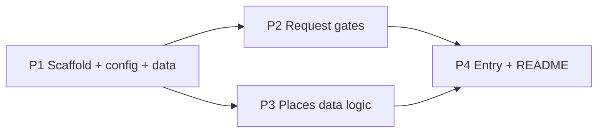

# Places API (New) — Cloudflare Worker Build Prompts

> **Status:** P1–P4 done (2026-08-09) — worker complete. Frontend follow-ups (photoUri model/store/preview) next.
> **Date:** 2026-08-09 (updated: P1 landed + photoUri storage strategy)
> **Source of truth:** `docs/ai-analysis/7-places-api-backend-contract.md`
> **Goal:** Build the Cloudflare Worker (Option A) that proxies Google Places API (New) for TripViewer, serving local / dev / prd from **one worker codebase**.
> **Format:** **4 prompts** — each prompt bundles related files so you run ~4 sessions instead of 10.

This doc breaks the worker into **4 ordered, mostly-parallel prompts**. Each prompt is self-contained (specs embedded) and groups files by concern; if any single prompt is still too big for one session, split it per-file (each file is listed separately) — the rest of the plan is unaffected. Shared contract details live in [§Shared Contract Reference](#shared-contract-reference).

> **⚠️ Deviation — photo strategy changed (2026-08-09).** The original plan proxied/signed short-lived photo URLs. That is **replaced** by the **store-stable-`photoUri`** strategy:
> - Google photo `name` refs **expire** and can't be cached; the resolved CDN `photoUri` (`lh3.googleusercontent.com/…`) is keyless and stable in practice.
> - Firebase Storage is **deactivated** (paid-only tier), so bytes can't be rehosted there — instead the worker resolves name → `photoUri` once at edit time and the frontend **stores `photoUri` on the Firestore `placeAPI` doc**; end users hotlink it directly (**zero** worker/Google calls per view).
> - Consequences: route 4 (byte proxy) is dropped, `photo-url.js` resolves CDN URLs instead of HMAC-signed ones, and `PHOTO_URL_SECRET` is **no longer required**. A byte-proxy fallback (old design) is documented as a contingency only if `photoUri` ever proves unstable in practice.
> - **Two Google API keys** (user decision 2026-08-09): `PLACES_API_KEY` (main) for `photos=false` requests, and `PLACES_PHOTOS_API_KEY` (dedicated) for anything photo-related — `photos=true` on routes 1/2 and route 3 (incl. the media endpoint). The `photos` param picks the key via `config.apiKeyFor(config, photos)`. Both are required secrets (mock mode bypasses).

---

## 1. Target structure

```
worker/
├── package.json                 # P1  wrangler (dev) + firebase-auth-cloudflare-workers
├── wrangler.toml                # P1  name, main, compatibility_date, [vars], secrets docs
├── README.md                    # P4  setup, secrets, run, deploy, smoke test
├── .gitignore                   # P1  .dev.vars, node_modules, .wrangler
├── .dev.vars.example            # P1  template for local secrets (never commit .dev.vars)
└── src/
    ├── index.js                 # P4  entry: router, CORS, origin/mode, wiring, errors
    ├── config.js                # P1  env + origin→mode detection (local/dev/prd)
    ├── auth.js                  # P2  Firebase ID token verification (multi-project + emulator)
    ├── permissions.js           # P2  allowed-uid check (allowlist / env override)
    ├── rate-limit.js            # P2  in-memory per-uid limiter (best-effort)
    ├── errors.js                # P2  error envelope + status mapping
    ├── normalize.js             # P3  §7 field mapping (rating/price/emoji/desc/…)
    ├── places.js                # P3  Google Places client (search/details/photo bytes)
    ├── photo-url.js             # P3  photo name → stable CDN photoUri (no HMAC, no proxy)
    └── data/
        ├── emoji-map.json       # P1  copy from scripts/export-maps-data/maps/
        ├── price-level-map.json # P1  copy from scripts/export-maps-data/maps/
        └── currencies.json      # P1  copy of public/assets/json/currencies.json (scaleNumeric price bands)
```

## 2. Dependencies & parallelization



| Batch | Prompts | What it creates |
|---|---|---|
| **1** | P1 | Foundation: package.json, wrangler.toml, .gitignore, .dev.vars.example, config.js, data JSONs |
| **2** (parallel) | P2, P3 | P2 = auth + permissions + rate-limit + errors · P3 = normalize + places + photo-url |
| **3** | P4 | index.js (router/wiring) + README + smoke test |

> If a single prompt is too big for one session, split P2/P3 per-file — the rest of the plan is unaffected.

---

## 3. The prompts

### P1 — Scaffold, config, data files  ✅ DONE (2026-08-09)

**Files created:** `worker/package.json`, `worker/wrangler.toml`, `worker/.gitignore`, `worker/.dev.vars.example`, `worker/src/config.js`, `worker/src/data/emoji-map.json`, `worker/src/data/price-level-map.json`, `worker/src/data/currencies.json`.

**Notes / deviations from the original prompt:**
- `package.json` (type module): dep `firebase-auth-cloudflare-workers@2.0.6`, devDep `wrangler@^3`, scripts `dev`/`deploy`.
- `wrangler.toml`: name `trip-viewer-places-api`, main `src/index.js`, compat `2026-08-01`, `[vars] FIREBASE_AUTH_EMULATOR_HOST=127.0.0.1:9099` (local only).
- `config.js`: exports `PROJECTS`, `ALLOWED_ORIGINS`, `LANG_MAP`, `getMode`, `isAllowedOrigin`, `readEnv`, `apiKeyFor`. `readEnv` returns `{ placesApiKey, placesPhotosApiKey, allowedUidsJson, emulatorHost, isMock }` and throws on missing keys unless `PLACES_API_MOCK` is truthy (added — lets local gate smoke-tests run without keys). `apiKeyFor(config, photos)` → photos key when `photos` truthy, else main key.
- **Two Google keys (`PLACES_API_KEY` + `PLACES_PHOTOS_API_KEY`) added (user decision):** main key for `photos=false`; dedicated photos key for `photos=true` / route 3 / media endpoint. Both required in non-mock use.
- **`PHOTO_URL_SECRET` dropped from `readEnv` (photoUri strategy):** secrets are now `PLACES_API_KEY` + `PLACES_PHOTOS_API_KEY` + `ALLOWED_UIDS_JSON`. `.dev.vars.example`/`wrangler.toml`/`config.js` updated to match.
- Data JSONs copied byte-identical: `emoji-map.json`, `price-level-map.json`, `currencies.json` (scaleNumeric).

**Acceptance:** ✅ all passed (getMode/isAllowedOrigin for all origins; readEnv happy-path + throw + mock bypass; data files parse).

---

### P2 — Request gates: auth + permissions + rate-limit + errors  ✅ DONE (2026-08-09)

**Files created:** `worker/src/auth.js`, `worker/src/permissions.js`, `worker/src/rate-limit.js`, `worker/src/errors.js`.

**Notes / deviations from the original prompt:**
- **`Auth.getOrInitialize()` is a GLOBAL singleton** in `firebase-auth-cloudflare-workers@2.0.6` — `Auth.instance` binds to the FIRST project id, so the second call for `trip-viewer-prd` returns the dev-bound instance (confirmed in source `dist/main/index.js`; a prd token then fails with `Expected "trip-viewer-dev"`). `auth.js` therefore constructs `new Auth(projectId, keyStore)` per project (lazy `Map`), preserving the intended dev/prd `aud`/`iss` separation.
- `errors.js` also defines `PermissionError` (403), `BadRequestError` (400), `NotFoundError` (404) and `UpstreamError` (429/502/503) alongside `ApiError`/`AuthError`, because P3's `places.js` depends on `NotFoundError`/`UpstreamError`.
- `permissions.js` fallback starter allowlist = the local dev admin UID (`eySHdjIyK0MNAgiPU77xE0d1CTjp`); override via `ALLOWED_UIDS_JSON`.
- `npm install` was run in `worker/` (adds `package-lock.json` + gitignored `node_modules`).

**Acceptance:** ✅ all passed — 24 checks: errors envelope (§10.1 exact shape) + status mapping; rate-limit 61st-in-window → false + `reset()` clears + per-uid isolation; permissions env-list → fallback → null; `verifyBearer` parse/reject; `verifyToken` empty → `AuthError('missing')`, garbage → `AuthError('invalid/expired')`, and a **real Auth emulator JWT** (user created on 127.0.0.1:9099) returning `{ uid, aud: 'trip-viewer-dev' }` in `local` mode (a synthetic prd-audience emulator token also verifies against `trip-viewer-prd`).

**Files:** `worker/src/auth.js`, `worker/src/permissions.js`, `worker/src/rate-limit.js`, `worker/src/errors.js`

**Prompt text:**
> Implement the four request-gate modules for the Places worker (all independent; build them in one session).
>
> **A. `auth.js` — Firebase token verification** (uses `firebase-auth-cloudflare-workers`, zero-deps, supports the Auth emulator; no service account needed for ID-token verification):
> - `verifyBearer(authorizationHeader)` parses `Bearer <token>`.
> - `async verifyToken(token, { mode, emulatorHost })`:
>   - Rejects empty tokens.
>   - Creates an `Auth` per project id (`Auth.getOrInitialize(projectId, keyStore)`): `trip-viewer-dev`, `trip-viewer-prd`. Use a small in-memory `KeyStorer` (`{ get(): Promise<value|null>, put(value, expirationTtl): Promise<void> }`) — no KV binding.
>   - For each project, `auth.verifyIdToken(token, false, env)` where `env = mode === 'local' ? { FIREBASE_AUTH_EMULATOR_HOST: emulatorHost } : undefined`. Return the first successfully verified claims.
>   - Success → `{ uid: claims.sub, aud: claims.aud }`; failure → typed `AuthError` (distinguish `missing` vs `invalid/expired`).
> - Note: `verifyIdToken` validates `aud`/`iss` per project, so a dev token verifies only against dev and a prd token only against prd — the intended dev/prd separation (contract §6.1).
>
> **B. `permissions.js` — allowed-UID gate:**
> - `async isUidAllowed(uid, env)`: primary = parse `env.ALLOWED_UIDS_JSON` (JSON array of uids); fallback = a committed starter allowlist exported from this file (a `Set`, commented "replace with the Firestore permission check later").
> - Export `getAllowedUids(env)` for debugging.
> - Deviation note (contract §6.1): the app's real permission source of truth is the Firestore doc `admin/permissions/canUsePlacesAPI/{uid}` (existence = has permission; read by `getPermissions()` in `data/firebase/database.ts`). Authentication alone is NOT enough. v1 uses an **allowlist** because the worker has no Firestore/service-account access and very few users hold this permission. Granting access = Firestore doc **and** `ALLOWED_UIDS_JSON` (two-step — document in README). Keep `isUidAllowed` thin so a Firestore check can replace it later without touching callers.
>
> **C. `rate-limit.js` — in-memory limiter:**
> - `createRateLimiter({ limit, windowMs })` → `{ check(uid): boolean, reset() }`. Sliding window via in-memory `Map<uid, number[]>`; `check` prunes timestamps older than `windowMs`, returns false when count ≥ `limit`, else records and returns true. Defaults `limit = 60`, `windowMs = 60_000`.
> - Comment clearly: **per-isolate / best-effort** (Cloudflare doesn't share memory across isolates); for production use Cloudflare dashboard **Rate limiting rules** (per-IP) or a KV/Durable-Object counter for strict per-uid accounting. This satisfies "rate limit if possible to check".
>
> **D. `errors.js` — error envelope + statuses:**
> - `class ApiError extends Error { constructor(status, code, message) }`.
> - `toEnvelope(err)` → `{ error: { code, message } }` (§10.1).
> - `toStatus(err)`: `AuthError` → 401; permission/bad-origin → 403; `NotFound` → 404; bad `q`/`lang` → 400; upstream → 429 (Google 429) / 502 / 503; else 500. Codes `places/*` (e.g. `places/not-found`, `places/unauthorized`).
> - `jsonResponse(status, body, corsHeaders)` → `Response` with `Content-Type: application/json` + CORS headers.

**Acceptance:** with the Auth emulator on 127.0.0.1:9099, `verifyToken` in `local` mode returns `{ uid, aud }` for an emulator JWT; garbage token → `AuthError('invalid/expired')`; missing header → `AuthError('missing')`; `isUidAllowed` honors env list then fallback; 61 calls in a window → `check` false on the 61st, `reset()` clears; `toEnvelope(new ApiError(404, 'places/not-found', 'Place not found'))` returns the exact §10.1 shape.

---

### P3 — Places data logic: normalize + places + photo-url

**Files:** `worker/src/normalize.js`, `worker/src/places.js`, `worker/src/photo-url.js`

**Prompt text:**
> Implement the Places API data modules (all independent; build them in one session).
>
> **A. `normalize.js` — §7 field mapping** (mirror `scripts/export-maps-data/export-maps-data.py`). Import `emoji-map.json`, `price-level-map.json`, `currencies.json` (JSON imports work in wrangler). Export `normalizePlace(raw, { photos })` returning:
> - `id` ← `raw.id`; `name` ← `raw.displayName.text`; `region` ← `raw.postalAddress.sublocality` (else `""`).
> - `website`/`instagram` ← from `raw.websiteUri`: contains `instagram.com` → `{ website: '', instagram: uri }`, else `{ website: uri, instagram: '' }`; empty uri → both `""`.
> - `rating` ← round to nearest integer as string, `""` if missing/non-numeric.
> - `price` ← `resolve_price_level(raw.priceRange, raw.priceLevel)`:
>   1. If `priceRange.startPrice`+`endPrice` exist: avg `(startPrice.units + endPrice.units)/2`, look up `currencies.scaleNumeric[currency]` bands for `$`,`$$`,`$$$`,`$$$$` (`[low, high]` or `[min]` = min-only, upper bound infinity), return first band where `low <= avg <= high`.
>   2. Else `price-level-map.json[raw.priceLevel]` (`PRICE_LEVEL_FREE→"-"`, `INEXPENSIVE→"$"`, `MODERATE→"$$"`, `EXPENSIVE→"$$$"`, `VERY_EXPENSIVE→"$$$$"`).
>   3. Else `"-"`.
> - `description` ← first non-empty of `editorialSummary.text` → `reviewSummary.text` → `primaryTypeDisplayName.text`.
> - `emoji` ← `resolve_emoji(raw.types)`: per type, exact match in `exact` map → wildcard substring (`wc in t or t in wc`) → first-token prefix of exact keys → first-token prefix of wildcard keys; return first hit, else `""`.
> - `map` ← `raw.googleMapsUri`; `businessStatus` ← `raw.businessStatus` (omit when absent); `photos` ← `raw.photos[].name` → `[{ name }]` only when the caller wants photos (else omit/`undefined`).
> - Emit scalar fields with `""` defaults; omit `businessStatus`/`photos` when not applicable.
>
> **B. `places.js` — raw Google Places client** (returns **raw** Google JSON; normalization is applied elsewhere). Base `https://places.googleapis.com/v1`; every call receives the `apiKey` to use (the caller picks it via `config.apiKeyFor(config, photos)` — main key vs dedicated photos key, see Deviation); headers always include `X-Goog-Api-Key: <apiKey>` + `X-Goog-FieldMask`; add a 30s timeout (`AbortSignal.timeout`) on all calls (contract §11).
> - `async searchText(query, { apiKey, lang, photos })` → `POST /places:searchText`, body `{ textQuery, pageSize: 5, languageCode }` (`LANG_MAP`), mask = §5.2 (shared reference; `photos` gates the `photos` field). Returns the JSON body.
> - `async getPlace(placeId, { apiKey, lang, photos })` → `GET /places/{placeId}` with `Accept-Language: languageCode`, mask = §5.1 (shared reference); 404/unknown → typed `NotFoundError`.
> - `async getPhotoUri(photoName, { apiKey, maxWidthPx = 1600 })` → `GET /v1/{photoName}/media?maxWidthPx=…&skipHttpRedirect=true&key=…` → returns the JSON `photoUri` (stable, keyless `lh3.googleusercontent.com/…` CDN URL). If `skipHttpRedirect` is unavailable, fall back to following the `Location` header of the 302 redirect. Caller passes the **photos key** (media endpoint is photo traffic). This is the **name → link** conversion used once per admin edit.
> - Throw typed `UpstreamError` on non-2xx (index maps 429/502/503).
>
> **C. `photo-url.js` — resolve stable CDN photo URLs** (replaces the old HMAC sign/verify; contract §4.2/§4.3 adapted — see Deviation):
> - `async photoUriFor({ apiKey, photoName, maxWidthPx = 1600 })` → thin wrapper around `places.getPhotoUri` (keeps the media-endpoint details out of route code). Caller passes the **photos key**.
> - Contingency only (NOT built in v1): if `photoUri` ever proves unstable in practice, re-add the old byte-proxy (`getPhotoBytes(photoName)` + short-lived signed `url`s + route 4). Documented for reference; do not implement unless photoUris break.

**Acceptance:** sample raw payloads (with/without priceRange, instagram websiteUri, exact/wildcard/first-token emoji paths, missing businessStatus) yield the exact §4.1 shape; `apiKeyFor(config, false) === config.placesApiKey` and `apiKeyFor(config, true) === config.placesPhotosApiKey`; with real keys, `searchText` ≤5 results, `getPlace` details or `NotFoundError`, `getPhotoUri` returns an `lh3.googleusercontent.com` URL (or throws `UpstreamError`); no HMAC/sign code exists.

---

### P4 — Entry (router + wiring) + README + smoke test  ✅ DONE (2026-08-09)

**Files created:** `worker/src/index.js`, `worker/README.md`.

**Notes / deviations from the original prompt:**
- `index.js` implements the exact P4 spec: CORS/preflight (`OPTIONS` → 204 + `Access-Control-Allow-Origin: <origin>` / `Vary: Origin` / methods / headers; allowlisted origins only, else 403); origin/mode via `getMode`; auth chain `verifyBearer → verifyToken → { uid, aud } → isUidAllowed → rateLimiter.check` (401 → 403 → 429); `config = readEnv(env)` resolved once per request, key picked via `apiKeyFor(config, photos)` — routes 1/2 use the `photos` query param, route 3 always uses `config.placesPhotosApiKey`.
- Routes 1/2/3 exactly as specced; route 4 (byte proxy) is NOT present — no `PHOTO_URL_SECRET`, no HMAC (photoUri strategy). Also: `405` for non-GET, `404 places/not-found` for unknown routes, `400 places/missing-q` (missing `q`), `400 places/invalid-lang` (en/pt only, default en), `photos` invalid → false. Every thrown error → `jsonResponse(toStatus(err), toEnvelope(err))`; CORS headers applied to every response including errors.
- `README.md`: what it does, env strategy (mode from Origin + token `aud`, never a client `env` flag), setup (`npm i`, `currencies.json` copy, `.dev.vars` from example), run (`npm run dev` + emulators), deploy (`wrangler deploy` + `wrangler secret put` — **no `PHOTO_URL_SECRET`**), two-step grant (Firestore `canUsePlacesAPI` doc **and** `ALLOWED_UIDS_JSON`), all deviations, and a curl smoke-test section (search/details/photos + 401/403/429 cases).
- Smoke test ran end-to-end: gates first in mock mode, then the live happy path with real keys in `.dev.vars` (emulator user UID in `ALLOWED_UIDS_JSON`).
- Tooling notes: `wrangler` is a local devDependency (not on PATH) → use `cd worker && npm run dev`. wrangler@3 warns the `2026-08-01` compat date falls back to `2025-07-18` (warning only; upgrade to wrangler@4 to silence). Biome does NOT scope `worker/` (biome.json `includes` = `public/**` + `functions/src/**` + root `*.ts`/`*.js`).

**Acceptance:** ✅ all passed — with the Auth emulator (:9099) + `wrangler dev` (:8787): CORS `OPTIONS` local origin → 204 with correct CORS headers (bad origin → 403); missing/no Origin → 403; bad origin + token → 403; no token → 401 `places/unauthorized`; garbage token → 401; missing `q` → 400 `places/missing-q`; invalid `lang` → 400 `places/invalid-lang`; unknown route → 404; `POST` → 405; rate limit → 429 `places/rate-limit` after 60/window/uid; every error carries CORS headers + the §10.1 envelope. Live (real keys): search → ≤5 normalized results (id/name/string rating/`$`–`$$$$`/emoji/photos refs); details → normalized place (pt + en description); photos route → exactly 3 keyless `lh3.googleusercontent.com` `photoUri`s, each loading as an image (HEAD 200 image/png·jpeg) with no auth/key. `node --check worker/src/*.js` clean.

**Files:** `worker/src/index.js`, `worker/README.md`

**Prompt text:**
> Implement the worker entry that composes P1–P3, then write the README.
>
> **`index.js`:**
> - `export default { async fetch(request, env) }`.
> - **CORS/preflight:** `OPTIONS` → 204 with `Access-Control-Allow-Origin: <request origin>`, `Access-Control-Allow-Methods: GET, OPTIONS`, `Access-Control-Allow-Headers: Authorization, Content-Type` (only when origin is allowlisted; else 403). Apply CORS headers on every response.
> - **Origin + mode:** `getMode(origin)` (config.js); `null` → 403. `mode` drives auth (`local` → emulator host; else Google keys).
> - **Auth middleware (JSON routes):** `verifyBearer` → `verifyToken` → `{ uid, aud }` (401 on failure) → `isUidAllowed(uid)` (403) → rate-limit `check(uid)` (429).
> - **Key selection:** resolve `config = readEnv(env)` once; pick per request via `apiKeyFor(config, photos)` — routes 1/2 use the `photos` query param; route 3 always uses `config.placesPhotosApiKey` (for both the details call and each `photoUriFor`).
> - **Routes:**
>   1. `GET /places/search?q&lang&photos` → `searchText` (P3) → map `places[]` via `normalizePlace` → `{ results }`.
>   2. `GET /places/{placeId}?lang&photos` → `getPlace` → `normalizePlace` → `{ place }`.
>   3. `GET /places/{placeId}/photos?lang` → `getPlace` (photos mask) → first 3 `photos[].name` → for each resolve via `photoUriFor` → `{ photos: [{ name, photoUri }] }`; none → `{ photos: [] }` (200). These `photoUri`s are keyless CDN URLs the frontend **stores on the Firestore `placeAPI` doc** and hotlinks in `` — end users never call the worker for photos.
>   - Removed: old route 4 (byte proxy `…/photos/{photoRef}?exp&sig`). No `PHOTO_URL_SECRET`, no HMAC in v1.
> - **lang:** `en`/`pt` (default `en`); invalid → 400. **photos:** route 1/2 `true|false` (default `false`); route 3 ignores it; invalid → treat as false.
> - Wrap handlers so every thrown error → `jsonResponse(toStatus(err), toEnvelope(err))` (P2). Timeout upstream via P3's `AbortSignal.timeout`.
>
> **`README.md`:**
> - What it does; the env strategy (local=`wrangler dev`, dev/prd=deployed single route; mode from Origin + token `aud`; never a client `env` flag); setup (`npm i`, copy `public/assets/json/currencies.json` → `src/data/currencies.json` if needed, create `.dev.vars` from `.dev.vars.example`); run (`npm run dev` with `firebase emulators:start`); deploy (`wrangler deploy`, then `wrangler secret put PLACES_API_KEY|PLACES_PHOTOS_API_KEY|ALLOWED_UIDS_JSON` — **no `PHOTO_URL_SECRET` needed**); how to grant access (Firestore `canUsePlacesAPI` doc **and** `ALLOWED_UIDS_JSON` — two-step).
> - Document deviations: photo strategy (store CDN `photoUri` on Firestore, no proxy/signing — see Deviation above); two Google keys (main vs photos — see Deviation); permission = allowlist (not Firestore doc) for v1 (two-step grant); price data from `currencies.json` `scaleNumeric` (not the old `moedas.json`).
> - Include a smoke-test section with curl examples (search/details/photos → expect 3 `photoUri`s that load as images without auth/key + 401/403/429 cases).

**Acceptance:** `wrangler dev` on :8787 with the emulator running: search ≤5 normalized results; details a normalized place; photos ≤3 `photoUri`s (each loads as an image in a browser with no auth/key); no/bad token → 401; unknown origin → 403; over-limit → 429. A developer can go clone → smoke test → deploy using only the README.

---

## Shared Contract Reference

### Routes (§3)
| # | Route | Params | Response |
|---|---|---|---|
| 1 | `GET /places/search` | `q`, `lang`, `photos=true`; token in header | `{ results: PlaceSearchResult[] }` (≤5) |
| 2 | `GET /places/{placeId}` | `lang`, `photos`; token in header | `{ place: PlaceDetails }` |
| 3 | `GET /places/{placeId}/photos` | `lang`; token in header | `{ photos: PlacePhoto[] }` (first 3, each `{ name, photoUri }`) |
| ~~4~~ | ~~`GET /places/{placeId}/photos/{photoRef}`~~ | ~~`exp`, `sig`~~ | ~~image bytes~~ — **removed** (photoUri strategy; no proxy in v1) |

### Field masks (§5)
GET (`X-Goog-FieldMask` on `GET places/{id}`; used by routes 2/3): `id, displayName, shortFormattedAddress, postalAddress, primaryTypeDisplayName, types, rating, priceLevel, priceRange, googleMapsUri, websiteUri, reviewSummary, editorialSummary, businessStatus, photos`
Search (`X-Goog-FieldMask` on `POST places:searchText`): same list prefixed with `places.`
> `photos` is included only when `photos=true` (§6.4).

### Auth (§6.1, §6.5)
- `Authorization: Bearer <firebase id token>` on every JSON route. `uid` never sent by client.
- Verify with `firebase-auth-cloudflare-workers` (`Auth.getOrInitialize(projectId, keyStore)` + `verifyIdToken(token, false, env)`); one `Auth` per project; in `local` mode pass `env = { FIREBASE_AUTH_EMULATOR_HOST: '127.0.0.1:9099' }`.
- No service account required for ID-token verification.
- Modes: `local` (Origin localhost/127.0.0.1), `dev` (`trip-viewer-dev.firebaseapp.com`), `prd` (`trip-viewer-prd.firebaseapp.com`). Unknown/missing origin → 403. **Never** trust a client `env` param.

### Permissions
- v1 = allowed-uid allowlist (`ALLOWED_UIDS_JSON` or fallback list). This mirrors (duplicates) the Firestore `admin/permissions/canUsePlacesAPI/{uid}` docs read by the frontend `getPermissions()`; granting access requires **both** the Firestore doc and the allowlist entry. Few users ever hold this permission, so the duplication is acceptable for v1. Later optional swap to a direct Firestore check (needs a service-account per project).

### Errors (§10)
- Envelope `{ error: { code, message } }`; 200 / 400 / 401 / 403 / 404 / 429 / 502 / 503 / 500. Frontend only checks `response.ok`.

### Photo URLs (§4.2/§4.3 — adapted)
- `` can't send `Authorization`, so the worker resolves each photo `name` to Google's **stable, keyless CDN `photoUri`** (`lh3.googleusercontent.com/…`) via the media endpoint with `skipHttpRedirect=true`.
- The frontend **stores `photoUri` on the Firestore `placeAPI` doc**; end users hotlink it directly — zero worker/Google calls per view.
- Google photo `name` refs expire (cannot be cached); `photoUri` is the stable asset. Contingency if `photoUri` ever breaks: re-add the byte-proxy (old HMAC design) — not built in v1.

### Env secrets
- `PLACES_API_KEY` (main Google key; used when `photos=false`), `PLACES_PHOTOS_API_KEY` (dedicated photos key; `photos=true` + route 3 + media endpoint), `ALLOWED_UIDS_JSON` (optional allowlist). **`PHOTO_URL_SECRET` removed** (no HMAC/proxy in v1). Both API keys required in non-mock use. Local: `.dev.vars` (gitignored); deployed: `wrangler secret put`.

### Data files
- `emoji-map.json`, `price-level-map.json` copied from `scripts/export-maps-data/maps/`.
- `currencies.json` copied from `public/assets/json/currencies.json` (replaced `moedas.json` after DB migrations 13–15). Price resolution uses its `scaleNumeric` bands.

---

## Suggested execution order

1. ~~P1 (scaffold/config/data).~~ ✅ **Done (2026-08-09)** — `PHOTO_URL_SECRET` already dropped from `readEnv`/`.dev.vars.example`/`wrangler.toml` (photoUri strategy).
2. ~~Batch 2 in parallel: P2 (request gates) and P3 (places data logic — photoUri version).~~ ✅ **Done (2026-08-09)**
3. ~~P4 (entry + README — no route 4).~~ ✅ **Done (2026-08-09)**

Each prompt can be handed to an agent verbatim. After each prompt, run `node --check worker/src/*.js` (syntax) and, once P4 lands, `wrangler dev` for an end-to-end smoke test. If any single prompt is too large for one session, split it per-file (files are listed separately) — the rest of the plan is unaffected.

### Follow-ups (outside this worker build)
- **Frontend:** `PlacePhoto` model `{ name, url }` → `{ name, photoUri }` in `places-api.model.ts` + mock; `places-apply.ts` stores `photoUri`s onto the Firestore `placeAPI` doc (new `photos` field → new DB migration); edit-destination dialog previews via `` (keyless). End-user destination view renders stored `photoUri`s with no worker call.

*End of build plan.*
