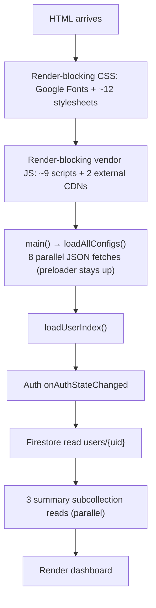

# Page Load Performance Analysis

> **Date:** 2026-09-03
> **Context:** User reports the app "takes way longer to load than other websites" and asks whether the cause is project structure or Firebase region. This doc traces the full home-page (`index.html`) load path and ranks the contributing factors.

---

## Verdict

The dominant cause is **project structure** (render-blocking assets + a long serial load chain). Firebase **region is a secondary factor** — it only affects Firestore read latency, and only matters if the database location is far from the user. Functions region does **not** affect page load at all (the home page calls no Cloud Functions on load).

---

## 1. The load chain (logged-in user)

First useful paint is gated by: **render-blocking CSS/JS → 8 config fetches → Auth resolution → 2 sequential Firestore round trips**.

---

## 2. Findings (in priority order)

### 2.1 Render-blocking vendor JS on every page

`public/shared/scripts-vendor.html` loads ~9 libraries as plain `<script>` tags (no `defer`/`async`), so they block the parser and each other:

| Script | Location | Used on index? |
|---|---|---|
| `aos.js` | local vendor | No |
| `bootstrap.bundle.min.js` | local vendor | Yes (UI) |
| `glightbox.min.js` | local vendor | No |
| **`isotope.pkgd.min.js`** (heavy) | local vendor | No |
| `validate.js` | local vendor | No |
| `typed.min.js` | local vendor | No |
| `waypoints` | local vendor | No |
| `swiper-bundle.min.js` | local vendor | No |
| `jquery.min.js` | local vendor | Yes (legacy) |
| `iconify.min.js` | **external CDN** (`code.iconify.design`) | Yes |
| `apis.google.com/js/api.js` | **external CDN** | Rarely |

Most libraries are page-specific but load on **every** page — including `index`.

### 2.2 Render-blocking CSS

`public/shared/head.html` includes:

- **External Google Fonts stylesheet** (`fonts.googleapis.com`).
- ~6 vendor CSS files (`aos`, `bootstrap`, `bootstrap-icons`, `boxicons`, `glightbox`, `swiper`).
- 5 base CSS files (`reset`, `fonts`, `variables`, `layout`, `dark-mode`).
- Per-page CSS (`main.css`, `index/index.css`).

**Notable gap:** the build already self-hosts fonts — `vendor-fonts.js` generates `public/assets/css/fonts.css` with `@font-face` rules — but `head.html` references `assets/css/base/fonts.css` (which only contains `"Chelos"`). The self-hosted Google Fonts are therefore **not wired in**, and every page still round-trips to `fonts.googleapis.com`.

### 2.3 Eight config JSONs gate first paint

`public/assets/ts/app/main.ts` awaits `loadAllConfigs()` (`public/assets/ts/app/config.ts`) before any page loader runs. It fetches 8 files in parallel:

`colors.json`, `destinations-config.json`, `itinerary.json`, `currencies.json`, `transportation.json`, `icons.json`, `version.json`, plus the active language pack.

The preloader (`#preloader` in `index.html`) stays visible until these all resolve, then `loadPage()` starts. Several of these (icons/itinerary/transportation) are only needed by specific pages, not the home dashboard.

### 2.4 Two sequential Firestore round trips for content

`public/assets/ts/pages/home/support/data.ts` → `loadUserIndex()`:

1. `registerIfUserNotPresent()` — reads `users/{uid}` (creating it if missing).
2. `getUID()` then `Promise.all` of 3 subcollection reads:
   `tripSummaries`, `destinationSummaries`, `listingSummaries` (already parallel ✓).

Auth resolution (`onAuthStateChanged`) must complete before either step.

### 2.5 Non-issues / already correct

- **Config JSONs are fetched in parallel** — good, but they're also a hard gate on first paint.
- **`useTimer` auto-reload never fires** — `loading.ts` has a 10-second timeout that can reload the page, but no caller uses `startLoadingScreen({ useTimer: true })`, so it is dead in practice.
- **HTML cache headers** are sensible: HTML `no-cache`, hashed assets `immutable` (prod), `/version.json` `no-store`.

---

## 3. Firebase region: what actually matters

| Service | Region-bound? | Impact on page load |
|---|---|---|
| Firestore | **Yes** — chosen at project creation (console, not code) | Read latency scales with client→DB distance |
| Cloud Functions | Yes — defaults to `us-central1` (no region config found) | **None on home page** — no function called during load |
| Firebase Auth | Global service | None |
| Firebase Hosting | Global CDN | None |

**Check:** Firebase console → Firestore Database → Settings → **Location**.

If the DB is `us-central1`/`nam5` and users are in Brazil, each read adds ~100–200 ms. Real, but secondary to findings 2.1–2.3.

> ⚠️ Firestore location is **immutable** once set. Moving to a closer region (e.g. `southamerica-east1`) requires export/import to a new project — a separate, significant project.

---

## 4. Recommended fixes (highest impact first)

1. **Defer/async vendor scripts** and load page-specific libs only where needed — drop `isotope`, `swiper`, `glightbox`, `typed`, `waypoints` (and ideally `aos`/`jquery`) from `index`.
2. **Self-host Google Fonts** — wire the existing `fonts.css` output into `head.html` and remove the external Google Fonts link. Inline critical CSS.
3. **Render the shell immediately** — stop gating first paint on all 8 config JSONs; lazy-load per-page configs and cache them (e.g. `localStorage`).
4. **Cut a Firestore round trip** — merge the 3 summary reads into one, or use `onSnapshot` with local cache.
5. **Region migration** (only if users are far from the DB location) — separate project effort; see §3.

---

## 5. Files referenced

| File | Role |
|---|---|
| `public/shared/head.html` | Render-blocking CSS + Google Fonts |
| `public/shared/scripts-vendor.html` | Synchronous vendor JS, external CDNs |
| `public/assets/ts/app/main.ts` | `main()` startup sequence |
| `public/assets/ts/app/config.ts` | `loadAllConfigs()` — 8 JSON fetches |
| `public/assets/ts/pages/home/index.ts` / `support/data.ts` | `loadUserIndex()` — Auth + Firestore |
| `public/assets/ts/data/firebase/database.ts` | Summary subcollection readers |
| `public/assets/ts/utils/loading.ts` | Preloader + (dead) 10 s auto-reload |
| `firebase-config.js` | Firebase init (no region config) |
| `firebase.json` | Hosting cache headers, rewrites |

---

## 6. Status

- [x] Structural analysis complete
- [ ] Fix 1 — defer/scope vendor scripts
- [ ] Fix 2 — self-host fonts / critical CSS
- [ ] Fix 3 — unblock first paint from config fetches
- [ ] Fix 4 — reduce Firestore round trips
- [ ] (Optional) Real timing via Lighthouse/network trace — requires browser validation
