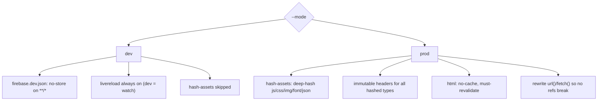

# Implementation Plan: Cache-Busting Strategy (Dev vs Prod)

**Status:** Proposed
**Date:** 2026-08-15
**Owner:** TBD
**Related backlog:** 🎨 Cache busting / build pipeline hardening
**Related docs:**
- `.github/skills/build-pipeline` (build flow, esbuild, livereload)
- `.github/skills/i18n-system` (language pack loading)
- `docs/implementation-plans/20260814-destination-page-card-refactor.md` (parallel-prompt format this doc follows)

---

## 1. Goal

Split the cache-busting behavior cleanly by environment:

- **Dev** (`npm run dev`): every edit shows up **automatically** — no manual cache clearing, no manual refresh. The browser must never serve stale content in dev.
- **Prod / env** (deploy): **stability** — unchanged assets keep the same URL and stay warm in the browser cache forever; only changed assets (or their importers) get a new URL.

Non-goals: don't change the Firestore data model, the deploy flow (`scripts/build/deploy.py`), the esbuild *format* (`esm`, `es2020`), or the per-page entry structure.

---

## 2. Current state (context map)

| Concern | Today | Key files |
|---|---|---|
| Cache headers | `.html/.json` → `no-cache, no-store, must-revalidate`; `.js/.css` → `public, max-age=31536000, immutable` | `firebase.json` |
| JS/CSS fingerprinting | Deep content-hash (`<stem>.<sha1-10><ext>`) + reference rewrite, run on **every** build incl. dev | `scripts/build/hash-assets.js` |
| What gets fingerprinted | Only `.js`/`.css` (incl. vendor). Images/fonts/JSON are **not** fingerprinted | `hash-assets.js` (`ASSET_EXTS`) |
| Reference rewriting | HTML `<script src>/<link href>`, JS `import/export … from`, dynamic `import()`, CSS `@import` — **not** CSS `url(...)` nor JS `fetch(...)` | `hash-assets.js` |
| JSON configs + language packs | Fetched at runtime via `fetch('/assets/json/...')`; served `no-store` → re-downloaded **every page load** | `public/assets/ts/app/config.ts` |
| Dev frontend watch | `dev` uses `watch:fast` = `--watch --no-livereload` (no auto-refresh); `dev:livereload` duplicates it with livereload | `package.json` |
| Emulator start | `firebase emulators:start --import --export-on-exit` with **no `--config`** → reads prod `firebase.json` (immutable headers) | `scripts/dev/start-emulator.js` |
| Build identity | None at build time; runtime hostname detection only | `firebase-config.js` |

**Key facts:**
- `hash-assets.js` runs unconditionally in `build.js` (step 2e), so dev already re-hashes changed `.js/.css` on every rebuild — but `dev` disables livereload, so the browser doesn't auto-refresh to pick the new names.
- Images/fonts have **no** header in `firebase.json`, so they fall back to Firebase's default caching (not immutable, but not controlled either).
- The language pack (`/assets/json/languages/{en,pt}.json`) is intentionally fetched fresh every load; combined with `no-store` this means **zero** cache reuse across visits.

---

## 3. Target architecture

```
BUILD_MODE ──┬─ dev  ──► no-store headers (firebase.dev.json)
             │           livereload ALWAYS on (dev = watch)
             │           hash-assets skipped (no-store makes it redundant)
             │
             └─ prod ──► content-hash .js/.css/.png/.jpg/.webp/.svg/.woff2/.json
                         immutable headers for all fingerprinted types
                         .html → no-cache (ETag/304), never no-store stale
```



---

## 4. Spec → solution map

| Requirement | Solution | Reuse (don't duplicate) |
|---|---|---|
| Dev edits show instantly | Always-on livereload (`dev` → `watch`) + `no-store` on every asset | existing `dist/reload` + `livereload.html` poll |
| Dev never serves stale js/css | `no-store` via dev config (skip hashing entirely) | `firebase.json` header syntax |
| Dev emulator uses dev headers | `--config firebase.dev.json` in `start-emulator.js` | `firebase.json` content (generated copy) |
| Prod unchanged assets stay stable | keep deep content-hash: identical content → identical URL | `hash-assets.js` deep-hash |
| Prod images/fonts/JSON also stable+immutable | extend `ASSET_EXTS` + rewrite `url()`/`fetch()` | same deep-hash machinery |
| Prod HTML cheaper revalidation | `.html` → `no-cache, must-revalidate` (304 via ETag) | Firebase auto-ETag |
| Single source of truth for headers | `gen-firebase-dev.js` derives `firebase.dev.json` from `firebase.json` | — |

---

## 5. Shared contract (flags / files / module ownership)

**Build flag (new):** `--mode dev|prod`. Default: `--watch` or `NODE_ENV=development` → `dev`; otherwise `prod`. Exposed to `inject-partials.js` and `hash-assets.js`.

**New static artifacts:**
- `firebase.dev.json` — generated (never hand-edited); full copy of `firebase.json` with the hosting `headers` block replaced by a single `no-store` rule.

**Module ownership (avoid merge conflicts across prompts):**

| File | Owner |
|---|---|
| `scripts/build/build.js` | P1 (mode flag) + P2 (skip hashing guard) |
| `scripts/build/gen-firebase-dev.js` (new) | P1 only |
| `scripts/dev/start-emulator.js` | P1 only (add `--config`) |
| `package.json` | P1 only (consolidate dev scripts) |
| `scripts/build/hash-assets.js` | P3 only |
| `firebase.json` | P1 (no change) + P3/P4 (header globs) |
| `public/assets/ts/app/config.ts` | P4 only (read-only changes, if any) |
| `.github/skills/build-pipeline/SKILL.md`, `README.md` | P5 only |

---

## 6. Workstreams — 5 prompts, 3 parallelizable

```
P1 (mode flag + dev config + dev script consolidation)
   │
   ├─► P2 (dev: force-bust behavior)          🟢 parallel after P1
   ├─► P3 (prod: fingerprint images/fonts/JSON) 🟢 parallel after P1
   └─► P4 (prod: HTML revalidation + JSON immutable) 🟢 parallel after P3
                        │
                        ▼
               P5 (verify both modes + docs)
```

---

### Prompt 1 — Build mode flag, dev config, and dev-script consolidation

**Goal:** introduce an explicit `dev`/`prod` seam and make `dev` always livereload.

**Do:**
1. `scripts/build/build.js`:
   - Add `--mode dev|prod` (default infer: `--watch` or `NODE_ENV=development` → `dev`, else `prod`).
   - Pass the mode into `inject-partials.js` and `hash-assets.js` calls.
2. New `scripts/build/gen-firebase-dev.js`:
   - Reads `firebase.json`, deep-copies it, and replaces the `hosting.headers` array with a single rule: `"source": "**/*"` → `Cache-Control: no-store`.
   - Writes `firebase.dev.json`. This keeps one source of truth for rewrites/redirects/SPA rewrite/functions.
3. `scripts/dev/start-emulator.js`:
   - Before spawning, run `gen-firebase-dev.js` (or `require` it), and add `--config=./firebase.dev.json` to the `firebase emulators:start` args.
4. `package.json` (consolidate dev scripts):
   - Change `dev` to use `npm run watch` (livereload) instead of `npm run watch:fast`.
   - **Delete `dev:livereload`.** Keep `watch` and `watch:fast` as the low-level frontend-watch entry points.

**Acceptance:**
- `node scripts/build/build.js --mode dev` and `--mode prod` both complete and log the mode.
- `npm run dev` starts emulators with `--config firebase.dev.json` and auto-refreshes on frontend edits (livereload).
- `firebase.json` is byte-identical to before; `firebase.dev.json` exists and contains a single `no-store` header rule + the original rewrites/redirects.
- `dev:livereload` is gone from `package.json`.

---

### Prompt 2 — Dev force-busting: skip hashing + verify no-store

**Goal:** dev edits are never stale, and dev builds stay fast.

**Do:**
1. In `build.js`, guard the `hash-assets.js` call behind `mode === 'prod'` (skip in dev). Log `[build] Hashing skipped (dev)`.
2. Keep the `dist/reload` timestamp + livereload injection in dev (already on after P1).
3. Optional belt-and-suspenders: in dev only, have `inject-partials.js` append `?v={{BUILD_ID}}` (`BUILD_ID = Date.now()`) to the entry `<script type="module">` in `scripts-core.html` — used **only** if verification in P5 shows the emulator isn't applying `no-store`.
4. Do **not** touch the prod hashing path.

**Acceptance:**
- In dev, edited `.ts`/`.css` files appear within one rebuild with no manual refresh (livereload + no-store).
- Edited images/fonts/JSON also appear immediately (no-store headers apply to all types).
- `npm run build` (prod) still runs `hash-assets` and emits hashed filenames.
- Decision point logged for P5: confirm via DevTools that dev responses carry `Cache-Control: no-store`; if not, flip the `?v=` fallback on and re-verify.

---

### Prompt 3 — Prod: fingerprint images, fonts, and JSON

**Goal:** everything served `immutable` is fingerprinted, so the header is always truthful and no stale/404 ever occurs.

**Do:**
1. In `hash-assets.js`, extend `ASSET_EXTS` to `.png .jpg .jpeg .webp .svg .gif .ico .woff .woff2 .ttf .otf .json` (keep `.js .css`).
2. **Exclude `assets/vendor/**`** from hashing (vendor never changes; keeps its URLs stable and skips wasted work).
3. Add CSS `url(...)` reference rewriting (today only `@import` is handled) — required now that images/fonts get renamed.
4. Add JS reference rewriting for `fetch("/assets/json/...")` literal paths (used by `app/config.ts` `loadJSON`) and `new URL("...", import.meta.url)` if any exist.
5. Update `firebase.json` header globs to mark the new types `immutable` (e.g. `*.@(js|css|png|jpg|jpeg|webp|svg|gif|ico|woff|woff2|ttf|otf|json)`), and remove `.json` from the `no-store` rule (see P4).

**Acceptance:**
- Two identical prod builds produce byte-identical hashed filenames (stability).
- Changing one file changes only that file's name + its importers' names (deep-hash behavior preserved for the new types).
- A full crawl (curl each referenced asset) shows **zero** 404s; `url(...)` and `fetch(...)` refs resolve to the hashed names.

---

### Prompt 4 — Prod: HTML revalidation + cached JSON

**Goal:** cheaper repeat visits without sacrificing freshness.

**Do:**
1. In `firebase.json`, change the `.html` header from `no-cache, no-store, must-revalidate` to `no-cache, must-revalidate` — HTML stays never-stale but can now return **304 Not Modified** via ETags.
2. Remove `.json` from the no-store rule (P3 moves JSON into the `immutable` rule), so the fingerprinted `/assets/json/languages/*.json` and other config packs are cached after first load.
3. In `public/assets/ts/app/config.ts`, remove the "always fetch language fresh" special-case if it prevents HTTP caching; keep the in-memory `_cache` semantics. Verify `loadLanguage` still re-fetches per language *switch* but hits the HTTP cache on repeat visits of the same pack.

**Acceptance:**
- Navigating between pages returns 304 for unchanged HTML.
- Language packs + config JSON load from HTTP cache on repeat visits; a language switch still fetches the correct pack.
- A content change to a language pack gets a new hashed URL and propagates immediately after deploy.

---

### Prompt 5 — Verify both modes + document

**Goal:** prove the dev/prod split holds under regression.

**Do:**
1. **Dev:** `npm run dev` → edit `.ts`, an image, a font, and a `.json`; confirm each shows instantly (livereload + no-store) with no manual cache clearing. Confirm `Cache-Control: no-store` in DevTools; if absent, enable the P2 `?v=` fallback.
2. **Prod:** build twice with no changes → identical hashed names; build with one changed `.ts` → only that file + importers change. Deploy to a preview channel and curl the headers for `.html`, `.js`, `.png`, `.woff2`, `.json`.
3. Update `.github/skills/build-pipeline/SKILL.md` (new `--mode` flag, dev config, hash-assets prod-only) and `README.md` if it documents scripts. Update the `dev` script descriptions.
4. Update repo memory (`/memories/repo/dev-environment.md`) to reflect the `dev:livereload` removal.

**Acceptance:**
- Both modes documented; a reviewer can reason about which assets bust and when, from the docs alone.
- No stale-content reproduction in dev; no unstable URLs in prod.
