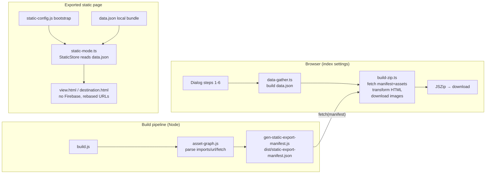

# Implementation Plan: Export as Static Web Page (Offline Mode)

**Status:** Done (P1–P4 implemented; see `.github/skills/static-export`)
**Date:** 2026-08-15
**Owner:** TBD
**Related backlog:** ⚔️ E043 — Export as static web page (Offline Mode) *(currently Medium Priority)*
**Related docs:**
- `.github/skills/build-pipeline` (build flow, esbuild, HTML injection, hash-assets)
- `.github/skills/typescript-conventions` (module organization, service layer, entry points)
- `.github/skills/backup-restore` (dialog-step UI, PIN flow, security warning, document bundle format)
- `.github/skills/data-model` (trip/destination/listing schema, PIN two-tier storage)
- `docs/implementation-plans/20260815-cache-busting-strategy.md` (parallel-prompt format this doc follows)

---

## 1. Goal

From the index **Settings** panel, let the user export a single document (trip, listing, or destination) as a **self-contained, downloadable ZIP** that renders the current `view.html` / `destination.html` experience **without Firebase**, reading the document and its associated data from **local JSON files** instead.

Two fidelity modes:

- **Light mode** — documents/JSON are static; images remain external URLs (smaller, still needs network for media).
- **Complete mode** — every image mapped on any exported document is pre-downloaded and saved inside the ZIP (heavier, fully offline for mapped media).
- **Both modes** — the app's own chrome is self-hosted: Iconify icons, the four web-font families, and no Google API loader (`gapi` is dead code and is stripped). The only remaining external requests are the user's own media (light mode) and the optional Plyr video lightbox (see §2).

User-customizable: **app title** and **icon** (so it can later be installed as a customized PWA).

Non-goals:

- Never export `index.html`, edit pages, standalone `expenses.html`/`itinerary.html`, Firebase config, or any file not reachable from the exported entry point.
- Do **not** change the Firestore data model, the normal deploy flow, the esbuild format, or the per-page entry structure.
- Do **not** make the exported page communicate with Firebase in any way (no SDK, no Auth, no Firestore).

---

## 2. Current state (context map)

| Concern | Today | Key files |
|---|---|---|
| Build pipeline | `public/ → dist/`, injects HTML partials, esbuild-compiles `.ts → .js` (per-file ESM, no bundling), content-hashes in prod | `scripts/build/build.js`, `inject-partials.js`, `hash-assets.js` |
| Firebase bootstrap | Firebase compat SDK from reserved `/__/firebase/*`, `/__/firebase/init.js`, root `index.js` imports `firebase-config.js` and calls `startFirebase()` | `public/shared/scripts-vendor.html`, `index.js`, `firebase-config.js` |
| Firebase read choke points | `get(path)`, `getAccommodations`, `getTransportation`, `getItinerary`, `getUser*Summaries`, `getSingleData`, `getTripComplete` | `public/assets/ts/data/firebase/database.ts` |
| Auth choke point | `getUID()` via `firebase.auth().onAuthStateChanged` | `public/assets/ts/data/firebase/auth.ts` |
| App boot | `main()` → `loadAllConfigs()` → `translatePage()` → `initializeApp()` (reads `firebase.app().options.projectId`) → page loader | `public/assets/ts/app/main.ts` |
| Exportable entry points | `view.html` (trip/listing via `?t=` / `?l=`), `destination.html` (destination via `?d=`) | `public/view.html`, `public/destination.html` |
| Document export precedent | Per-document JSON export with type selector → doc list → PIN table → download, plus security warning | `public/assets/ts/backup/export-documents.ts` |
| Dialog UI | `displayFullMessage`, `MESSAGE_PROPERTIES`, styles in `components/modal.css` | `utils/messages.ts`, `backup/export-documents.ts` |
| Asset fingerprinting | Deep content-hash + reference rewrite (HTML/JS/CSS/JSON) — already walks import graph + `url()`/`fetch()` | `scripts/build/hash-assets.js` |
| Dev nav helper | Injected but renders only with `?ai=1` (AI/dev only) | `public/shared/nav-helper.html` |
| Zipping | Not present today | — |

**Key facts:**

- The built `dist/` page HTML already contains the **final** (prod: hashed) asset URLs, injected partials, and the Firebase `<script>` tags.
- `hash-assets.js` already parses the JS import graph, CSS `@import`/`url()`, and JS `fetch()` literals — this is exactly the machinery needed to compute "which files does this page actually use".
- `view.ts` loads a trip via `getTripComplete(tripId, false)` (single trip doc read + subcollection readers); `destination.ts` loads via `mountDestination` → `get` on `destinations/{id}`.
- Protected data is read at runtime via `get(`${type}/protected/${PIN}/${id}`)` and `expenses/protected/${PIN}/${id}` — so the local bundle must expose those exact paths.
- The `firebase` global is hard-referenced by many compiled modules; a static page therefore needs either a defensive stub or guards at every Firebase touch point (we do **both**: guards at the choke points + a loud stub for anything missed).
- **ESM and `fetch()` do not run from `file://`.** The app is per-file ESM (`<script type="module">`) and boots via `fetch()` (config JSONs; in static mode also `data.json`). Browsers block both under `file://`, so the exported ZIP must be **served over HTTP** (a local static server, e.g. `npx serve`, or any static host). It is a self-contained *site*, not a double-click-to-open file. True `file://` support would require bundling all JS to a classic script and inlining every JSON config + icons + fonts — a separate, much larger effort (out of scope).
- **External CDNs today:** Iconify (`code.iconify.design`, every `data-icon`), Google Fonts (`fonts.googleapis.com`), `apis.google.com/js/api.js`, and Plyr (`cdn.plyr.io`, used only by GLightbox's video player). The first three are app chrome and are self-hostable (P1-D); `api.js` is **dead code** (no `.ts` references `gapi`) and is simply stripped from the export. Plyr stays external (edge case).
- **Target "offline":** no Firebase SDK/Auth/Firestore, no network for *document data + mapped media*, and no CDN requests for icons/fonts. Remaining network in the export: user media in light mode, and the Plyr video lightbox.

---

## 3. Target architecture

```
Settings → exportStaticOnClickAction()
   │
   ├─ 1. Security warning dialog (plain-text data, same as backup/export)
   ├─ 2. Type selector: trip | listing | destination
   ├─ 3. Document list (from user summaries, like export-documents)
   ├─ 4. Mode: light | complete
   ├─ 5. App title + icon (optional)
   └─ 6. Build & download ZIP

No PIN step: the PIN for a `sensitive-only` trip is auto-resolved from the
owner-readable `protected/{tripId}` lookup doc (`resolveTripPin()` in
`document-bundle.ts`) during `buildStaticData()` — the owner never types it.
```



**Where the export runs (decision): fully client-side in the browser.**

- Firebase free tier ⇒ no Functions/Storage. The Cloudflare workers are the `workers/places-api/` Places proxy and the `workers/image-proxy/` batch image downloader; neither is a general backend.
- All needed data is already readable client-side via the Firestore SDK the app already uses.
- The static assets to package are already served by Firebase Hosting (`dist/`) and fetchable same-origin.
- The Settings UI is already a client-side dialog-step flow (backup/restore) — this mirrors it exactly.
- ZIP is produced in-browser with a vendored **JSZip** (consistent with the existing vendor-script pattern).

No server the user must run, no new Firebase Function. The export build runs
client-side; complete-mode image downloads add ONE new Cloudflare worker
(`workers/image-proxy/`) that fetches all mapped images server-side in a
single request.

---

## 4. Spec → solution map

| Requirement | Solution | Reuse (don't duplicate) |
|---|---|---|
| Export option in index Settings | New button + `registerActions` entry, wired like `export-documents` | `home/support/event-listeners.ts`, `index.html` |
| Dialog steps like backup/restore | `displayFullMessage`/`MESSAGE_PROPERTIES` + PIN table + `start/stopLoadingScreen` | `utils/messages.ts`, `backup/export-documents.ts` patterns |
| Same exposed-data warning | Reuse the security-warning text pattern | `account.export_documents.security_warning` (new key) |
| Select a document (trip/destination/listing) | Same type→list flow using user summary subcollections | `getUser*Summaries` |
| Protected-data PIN | Auto-resolved from the owner-readable `protected/{tripId}` lookup doc during `buildStaticData` — no prompt | `document-bundle.ts` `resolveTripPin()` |
| Gather associated docs → local JSON | Shared bundle builder + `data.json` with `paths` map | extract from `backup/export-documents.ts` |
| Light vs complete mode | Light keeps external URLs; complete downloads & rewrites mapped images | image-URL inventory in `data-gather.ts` |
| App title + icon | Inputs in dialog; applied to `<title>`, generated `site.webmanifest`, icons | PWA meta already in `head.html` |
| Use current public code, not a fork | Build-time **manifest** of exactly the files each entry needs | `asset-graph.js` (reuses `hash-assets.js` parsing logic) |
| Entry point = view (trip/listing) or destination | Manifest exposes per-entry file sets; builder picks one | `PAGES[]` in `inject-partials.js` |
| Never export index/edit/etc. | Manifest whitelist is entry-derived; index/edit/expenses/itinerary excluded by construction | — |
| No TripViewer logo link, no home/back buttons | Export-time HTML transform (logo `<a>` → `<div>`, remove `#back`/`#closeButton`, strip `nav-helper`) | served HTML post-processing |
| No Firebase in exported page | Strip `/__/firebase/*` + `index.js` module script; inject static bootstrap | served HTML post-processing |
| Static mode runtime flag | `window.TRIPVIEWER_STATIC` + `static-mode.ts` + guards in DB/auth choke points | single flag consumed everywhere |
| Smart: no tinkering on future changes | Manifest regenerated every build from the actual import/asset graph | `asset-graph.js` (parsers copied from `hash-assets.js`) |
| Files out of context excluded | Manifest lists only reachable files + fixed favicon/manifest set | per-entry transitive closure |

---

## 5. Shared contract (flags / files / schemas)

This contract lets the three P1 workstreams be built in parallel with zero shared files.

### 5.1 Runtime globals (set by the injected bootstrap, before the entry module)

```html
<script>
  window.TRIPVIEWER_STATIC = true;
  window.TRIPVIEWER_STATIC_CONFIG = {
    title: "My Trip",                // user-chosen app/page title
    icon: "images/icon-192.png",     // optional custom icon path ("" = default)
    ownerUid: "eySH...",             // owner uid copied from export meta
    dataUrl: "data.json",            // relative path to local data bundle
    mode: "light" | "complete"
  };
  // Defensive stub — turns any UNGUARDED Firebase call into a loud error during dev/verification
  window.firebase = {
    app: function () { return { options: { projectId: 'static-export' } }; },
    auth: function () { throw new Error('[static-export] firebase.auth() called unexpectedly'); },
    firestore: function () { throw new Error('[static-export] firebase.firestore() called unexpectedly'); },
    storage: function () { throw new Error('[static-export] firebase.storage() called unexpectedly'); }
  };
</script>
```

### 5.2 `data.json` schema (local bundle)

```json
{
  "meta": {
    "version": 1,
    "type": "trip | listing | destination",
    "sourceId": "<docId>",
    "title": "<doc title>",
    "exportedAt": "ISO-8601",
    "ownerUid": "<uid>",
    "mode": "light | complete",
    "images": { "<originalUrl>": "images/<sha1-12>.<ext>" }
  },
  "paths": {
    "trips/<id>": { "...trip doc..." },
    "trips/<id>/accommodations": { "<accId>": { "id": "<accId>", "...fields..." } },
    "trips/<id>/transportation": { "_settings": { "viewMode": "simple" }, "<legId>": { "id": "<legId>", "...fields..." } },
    "trips/<id>/itinerary": { "<dayId>": { "id": "<dayId>", "...fields..." } },
    "trips/protected/<pin>/<id>": { "...protected trip doc..." },
    "expenses/<id>": { "...expenses doc..." },
    "expenses/protected/<pin>/<id>": { "...protected expenses doc..." },
    "destinations/<id>": { "...destination doc..." },
    "listings/<id>": { "...listing doc..." },
    "protected/<id>": { "pin": "<pin>", "sharing": { "...": "..." } }
  }
}
```

> `paths` keys are the **exact** Firestore paths the app requests at runtime, so `StaticStore` is a trivial `paths[key]` lookup — no path translation. Collection values are stored in the **same shape the real readers return** (`{id, ...}` maps for acc/itinerary; `{_settings, ...}` for transportation).

### 5.3 `static-export-manifest.json` schema (emitted by the build)

```json
{
  "generatedAt": "ISO-8601",
  "mode": "prod | dev",
  "entries": {
    "view": {
      "html": "view.html",
      "files": ["view.html", "assets/ts/.../view-entry.<hash>.js", "...", "assets/css/**", "assets/json/**", "assets/vendor/**", "assets/fonts/**", "assets/img/**", "apple-touch-icon.png", "favicon-*.png", "favicon.ico", "site.webmanifest", "browserconfig.xml", "safari-pinned-tab.svg", "mstile-150x150.png", "android-chrome-*.png"]
    },
    "destination": { "html": "destination.html", "files": ["..."] }
  }
}
```

`files` is the **transitive closure** from the entry HTML + entry JS (imports, dynamic imports, `fetch("/assets/...")`, CSS `@import`/`url()`, JSON asset-path strings) **plus** a fixed favicon/manifest set from `head.html`. Excluded by construction: `index.html`, `edit/**`, `expenses.html`, `itinerary.html`, `index.js`, `firebase-config.js`, `firebase.json`, `firebase.dev.json`, `reload`, and the manifest itself.

### 5.4 Static-mode module API (`static-mode/static-mode.ts`)

```ts
export function isStaticMode(): boolean;                       // window.TRIPVIEWER_STATIC === true
export function staticConfig(): StaticConfig;                   // window.TRIPVIEWER_STATIC_CONFIG
export async function loadStaticData(): Promise<void>;          // fetch(dataUrl) → in-memory store
export function getStaticDoc(path: string): any | undefined;    // paths[path]
export function getStaticCollection(path: string): any;         // paths[path] (already reader-shaped)
```

### 5.5 Module ownership (avoid merge conflicts across prompts)

| File | Owner |
|---|---|
| `public/assets/ts/static-mode/static-mode.ts` (new) | P1-A only |
| `public/assets/ts/data/firebase/database.ts` | P1-A only |
| `public/assets/ts/data/firebase/auth.ts` | P1-A only |
| `public/assets/ts/app/main.ts` | P1-A only |
| `scripts/build/asset-graph.js` (new) | P1-B only (HTML `<script src>`/`<link href>`/`` + CSS `@import`/`url()` + JS import/JSON-string parsers, copied from `hash-assets.js`) |
| `scripts/build/gen-static-export-manifest.js` (new) | P1-B only |
| `scripts/build/hash-assets.js` | P1-B only (add `static-export-manifest.json` to `EXCLUDED_FILES`; otherwise leave as-is) |
| `scripts/build/build.js` | P1-B only (add manifest step) |
| `scripts/build/gen-iconify-bundle.js` (new) | P1-D only |
| `scripts/build/vendor-fonts.js` (new) | P1-D only |
| `public/assets/vendor/iconify/iconify.min.js` (new) | P1-D only |
| `public/assets/fonts/**` + `public/assets/css/fonts.css` (new) | P1-D only |
| `public/assets/ts/backup/document-bundle.ts` (new) | P1-C only |
| `public/assets/ts/backup/export-documents.ts` | P1-C only (refactor to use document-bundle; JSON output unchanged) |
| `public/assets/ts/static-export/data-gather.ts` (new) | P1-C only |
| `public/assets/ts/static-export/export-static.ts` (new) | P1-C only |
| `public/index.html` | P1-C only |
| `public/assets/ts/pages/home/support/event-listeners.ts` | P1-C only |
| `public/assets/json/languages/en.json`, `pt.json` | P1-C only |
| `public/assets/css/components/modal.css` | P1-C only |
| `public/assets/vendor/jszip/jszip.min.js` (new) + `vendor.d.ts` | P1-C only |
| `public/assets/ts/static-export/build-zip.ts` (new) | P2 + P3 |
| `.github/skills/*`, `README.md`, `docs/README.md`, CHANGELOG, repo memory | P4 only |

---

## 6. Workstreams — 6 prompts, 3 parallel at the start

```
P1-A (runtime static-mode seam)   ─┐
P1-B (build asset-graph + manifest)│
P1-C (export UI + data gathering)  ├─► P2 (export builder + ZIP) ─► P3 (polish + edge cases) ─► P4 (verify + docs)
P1-D (self-host icons + fonts)     ─┘
```

---

### Prompt 1-A — Runtime static-mode seam

**Goal:** the exported page can boot and render with **no Firebase SDK**, reading documents from a local `data.json`.

**Do:**

1. New `public/assets/ts/static-mode/static-mode.ts`:
   - `isStaticMode()`, `staticConfig()`, `loadStaticData()` (fetch `dataUrl` once, cache in module), `getStaticDoc(path)`, `getStaticCollection(path)`.
   - `installFirebaseStub()` — sets the §5.1 defensive `window.firebase` (no-op if already present). Called from `loadStaticData()` or main guard.
2. `public/assets/ts/data/firebase/database.ts` — at the top of **read-only** functions, short-circuit to the static store when `isStaticMode()`:
   - `get(path)` → `getStaticDoc(path)` (return `undefined` when missing; do not set `ERROR_FROM_GET_REQUEST`).
   - `getAccommodations(tripId)` → `getStaticCollection(\`trips/${tripId}/accommodations\`)` (array of `{id,...}`).
   - `getTransportation(tripId)` → `getStaticCollection(...)` returning `{ legs, settings }`.
   - `getItinerary(tripId)` → array of `{id,...}`.
   - `getUser*Summaries(uid)` → not used by view/destination pages, but guard anyway to return `[]` (prevents stray Firestore calls).
   - Leave write paths (`create/update/override/delete*`) untouched — they are never reached in static mode, and the stub will scream if they are.
3. `public/assets/ts/data/firebase/auth.ts` — `getUID()` returns `staticConfig().ownerUid` in static mode; `getUser()` returns `undefined`. (No `firebase.auth()` call.)
4. `public/assets/ts/app/main.ts` — `initializeApp()`: in static mode set `APP.projectId = 'static-export'` (skip `firebase.app().options.projectId`); skip `startFirebase`-related logic (not present in this file anyway).
5. In `main()` (or `loadStaticData()`), if static mode, `await loadStaticData()` **before** `loadAllConfigs()` so the store is ready before page loaders run.

**Acceptance:**

- Hand-crafted fixture (`view.html` with the §5.1 bootstrap + a `data.json` for a trip) renders the trip in a browser with **no** `/__/firebase/*` scripts present and **no** `firebase is not defined`.
- Sensitive reservation reveal works (reads `trips/protected/{pin}/{id}` from the store).
- In normal (non-static) mode, all existing behavior is unchanged (`npm run build` + a smoke test of `view.html`).

---

### Prompt 1-B — Build asset-graph + export manifest

**Goal:** the build emits `dist/static-export-manifest.json` listing, per exportable entry, exactly the files it needs — automatically, so future code changes never require manual manifest edits.

**Do:**

1. New `scripts/build/asset-graph.js` — the manifest's reference parser, decoupled from `hash-assets.js`.
   - **Copy (do not share)** the reference parsers from `hash-assets.js`: JS `import`/`export … from`/dynamic `import()`/string-literal `fetch()`/JSON asset-path values, CSS `@import`/`url()`, plus `isLocalSpec`/`resolveToRel`/`collectLocalFiles`. Add HTML ``, `<link rel="preload" href>`, `<link rel="manifest" href>`, and `<meta name="msapplication-config" content>` (the last three `hash-assets.js` does not parse today).
   - Do **not** refactor `hash-assets.js` to consume `asset-graph.js`. "Byte-identical" is only provable with a diff harness, and the hashing pass's rename/rewrite loop is load-bearing; duplicating ~40 lines of regex is cheaper and safer than a cross-cutting refactor. `hash-assets.js` stays unchanged apart from the `EXCLUDED_FILES` addition (step 4).
   - Export `collectLocalFiles`, `walkImports(root, entryFiles)` (transitive JS import closure from an entry `.js`), and `walkCss(root, cssFiles)` (CSS `@import`/`url()` closure).
2. New `scripts/build/gen-static-export-manifest.js`:
   - Define the fixed head-assets set (favicons, `site.webmanifest`, `browserconfig.xml`, `safari-pinned-tab.svg`, `mstile-150x150.png`, `android-chrome-*`).
   - For each entry (`view.html`, `destination.html`): read the **injected** HTML in `dist/` (it already contains `scripts-vendor.html`/`head.html`/`top-bar.html` content). Parse `<script src>` (local only), `<link href>`, ``, `<link rel="preload" href>`, `<link rel="manifest" href>`, `<meta name="msapplication-config" content>`. Walk the entry JS import closure (`walkImports`) and the CSS `@import`/`url()` closure (`walkCss`); union with the fixed head set.
   - **Exclude** `index.html`, `edit/**`, `expenses.html`, `itinerary.html`, `index.js`, `firebase-config.js`, `firebase.json`, `firebase.dev.json`, `reload`, and `static-export-manifest.json` itself. Do **not** include `/__/firebase/*`, `https://`, `//`, `data:` references (external by design). `assets/vendor/**` **is** included (the exported page needs the vendor CSS/JS).
   - Expect the JS closure to pull in `edit-trip`/`edit-destination` modules (`database.ts` imports `pages/edit-trip/categories/destination.js`; `mount.ts` imports `edit-destination.ts`) — harmless (their write paths are never invoked in static mode) but legitimately present in the manifest.
   - **Verification pass**: after computing `files`, rescan the same HTML/CSS/JS/JSON for every local reference and assert it is present in the set; fail the build on any gap (catches future reference types the parsers don't know).
   - **Add the P1-D self-host set explicitly** (not discovered — the live HTML never references them): `assets/vendor/iconify/iconify.min.js`, `assets/json/iconify-icons.json`, `assets/css/fonts.css`, `assets/fonts/**`. These keep stable (unhashed) names so the P2 transform can reference them by fixed relative path.
   - Write `dist/static-export-manifest.json` (§5.3), with **final (hashed in prod)** filenames.
3. `scripts/build/build.js`:
   - Call `gen-static-export-manifest.js` **after** `hash-assets.js` in prod, and after TS compile in dev (so it always sees final `dist/`).
4. `scripts/build/hash-assets.js` — add `static-export-manifest.json` **and the P1-D self-host set** (`assets/json/iconify-icons.json`, `assets/css/fonts.css`, `assets/fonts/**`; `assets/vendor/**` is already excluded) to `EXCLUDED_FILES` so they keep stable names and are never renamed/rewritten.

**Acceptance:**

- `npm run build` (prod) and `npm run watch` (dev) both produce a valid `dist/static-export-manifest.json`.
- The manifest's `view`/`destination` file sets contain **no** `index.html`, edit pages, `index.js`, or `firebase-config.js`, and **do** include `assets/vendor/**`, CSS, JSON configs, and fonts.
- The verification pass reports no missing local asset for either entry (fail-on-gap).
- Adding a new import/`fetch("/assets/…")`/CSS `url()` to a view or destination module changes the manifest automatically on the next build; removing it shrinks it. Two identical builds produce byte-identical manifests.
- `hash-assets.js` output is unchanged (regression: a prod build's hashed file set is identical before/after this prompt).

---

### Prompt 1-C — Export UI + data gathering + shared bundle extraction

**Goal:** the Settings dialog flow exists end-to-end up to producing a correct `data.json` (zip comes in P2).

**Do:**

1. New `public/assets/ts/backup/document-bundle.ts`:
   - Extract the pure gather logic currently private in `export-documents.ts`: `getCollectionDocs`, `getDocument`, `fetchReferencedDestinations`, `fetchProtectedData`, and `buildTripExport`/`buildDestinationExport`/`buildListingExport` bodies (returning the same `{ _meta, trip/destination/listing, accommodations?, transportation?, itinerary?, expenses?, destinations?, protected? }` shape).
   - Refactor `export-documents.ts` to call it — **JSON export output must stay byte-for-byte compatible** (same `_meta`, same fields).
2. New `public/assets/ts/static-export/data-gather.ts`:
   - `buildStaticData(type, id, pin, mode)` → uses `document-bundle.ts`, then flattens into the §5.2 `paths` map (trip → `trips/{id}`, subcollections → reader-shaped maps, protected → `trips/protected/{pin}/{id}` + `expenses/protected/{pin}/{id}` when the expenses module is on, referenced/full destinations → `destinations/{id}`, listing → `listings/{id}`, `protected/{id}` lookup).
   - `collectImageUrls(doc)` → inventory of image URLs from the **known image-bearing fields** only: trip `image.background`, `gallery.images[].link`, accommodations `images[].link`, transportation (none), destination `image.background`, destination entry `images[].link`, listing `image.background` (if present), plus any `logo` fields. Store into `meta.images` (empty in light mode).
   - Validate the 4-digit PIN when the trip is `pin: sensitive-only` (reject before building).
3. New `public/assets/ts/static-export/export-static.ts`:
   - `exportStaticOnClickAction()` → dialog steps: **security warning** → **type selector** (trip/listing/destination) → **document list** (from `getUser*Summaries`, single-select) → **PIN** (required for protected trips; reuse the PIN table pattern but single row + validation) → **mode** (light/complete radio) → **title + icon** (text input + optional image file input) → call the P2 builder.
   - Use `displayFullMessage`/`MESSAGE_PROPERTIES`, `start/stopLoadingScreen`, `openToast`.
4. `public/index.html` — add a Settings button: `data-action="export-static"` (icon + `data-translate="account.export_static.title"`).
5. `public/assets/ts/pages/home/support/event-listeners.ts` — `registerActions({ 'export-static': () => exportStaticOnClickAction(), ... })`.
6. i18n — add `account.export_static.*` keys in `en.json` + `pt.json` (title, warning, select_type, select_document, pin_instruction, pin_required, mode_light, mode_complete, mode_light_hint, mode_complete_hint, app_title, app_icon, build, building, success, partial_success, failed, none_selected, no_documents).
7. CSS — add static-export dialog styles next to the existing `.export-documents-*` block in `public/assets/css/components/modal.css`.
8. Vendor — add `public/assets/vendor/jszip/jszip.min.js`, a `<script>` tag **only on `index.html`** (not `scripts-vendor.html`, so it never leaks into exports), and a `JSZip` declaration in `public/assets/ts/vendor.d.ts`.

**Acceptance:**

- Clicking the new Settings action walks all dialog steps with correct i18n and dark-mode styling.
- Selecting a protected trip **requires** a valid 4-digit PIN; invalid input blocks progression.
- In dev, the flow produces a `data.json` (temporarily downloadable for inspection) whose `paths` keys exactly match the runtime requests and whose `meta.images` inventory is complete for complete mode.
- Existing `export-documents` JSON export still produces identical files (regression check).

---

### Prompt 1-D — Self-host icons & fonts (drop dead `gapi`)

**Goal:** eliminate the last CDN requests from the exported page: Iconify, Google Fonts, and the unused `apis.google.com` loader. Export-only — the live site keeps its CDN `<link>`/`<script>` tags unchanged.

**Do:**

1. New `scripts/build/gen-iconify-bundle.js`:
   - Scan `public/` for every icon name: `data-icon="…"` in HTML, `data-icon="…"` / `data-icon="${…}"` literal values in `.ts`, and icon values in `assets/json/icons.json` + `assets/json/transportation.json`.
   - Resolve each `prefix:name` to its SVG body via the Iconify API (build machine online), emitting `dist/assets/json/iconify-icons.json` in Iconify collection format (grouped by prefix). Cache resolutions in `tmp/iconify-cache.json` so later builds are deterministic and work offline.
   - Fail the build if any collected name cannot be resolved.
2. Vendor the Iconify runtime: add `public/assets/vendor/iconify/iconify.min.js` (committed, like other vendor scripts). Use the current `@iconify/iconify` if the pinned 2.1.0 global lacks the observer pause/resume API (see step 5).
3. New `scripts/build/vendor-fonts.js`:
   - Download the woff2 files for Open Sans / Raleway / Inter / Poppins (latin subset, exactly the weights listed in `head.html`) into `public/assets/fonts/`, and generate `public/assets/css/fonts.css` with the matching `@font-face` rules (`font-display: swap`). Commit both.
4. `scripts/build/build.js` — run both generators **before** `hash-assets.js` so the files exist in `dist/`; the files keep stable names (see P1-B step 4).
5. Iconify registration contract (for P2): the transform inlines `iconify-icons.json` as `window.__TRIPVIEWER_ICONS__` and, in the first `<script>` after the vendored runtime, calls `Iconify.addCollection()` for each prefix **before** Iconify scans `[data-icon]` (pause observation first if the runtime has already started, then resume). Icons already present in a registered collection never trigger Iconify's on-demand loader, so no network request is made.

**Acceptance:**

- `npm run build` emits `dist/assets/json/iconify-icons.json` covering **every** icon referenced anywhere in `public/` (HTML + TS + JSON configs), with no unresolved names.
- `dist/` contains `assets/vendor/iconify/iconify.min.js`, `assets/css/fonts.css`, and `assets/fonts/*.woff2`.
- A served fixture that registers the collections renders icons with zero requests to `code.iconify.design`, and fonts with zero requests to `fonts.googleapis.com`.
- The live site's behavior is unchanged (`head.html`/`scripts-vendor.html` still reference the CDNs).

---

### Prompt 2 — Export builder + ZIP (integration)

**Goal:** the full flow produces a working, downloadable ZIP that renders standalone.

**Do:**

1. New `public/assets/ts/static-export/build-zip.ts`:
   - `buildStaticExport(entry, data, config)`:
     a. `fetch('static-export-manifest.json')` → pick `entries[entry]` (`view` for trip/listing, `destination` for destination).
     b. `fetch` each file in `files` (same-origin). Keep the zip path = manifest path.
     c. **Transform the entry HTML**:
        - Remove `/__/firebase/*` `<script>`s and `<script type="module" src="index.js">` (the Firebase bootstrap).
        - Remove `<script src="https://apis.google.com/js/api.js">` (dead — no `.ts` file references `gapi`).
        - Replace the Iconify CDN `<script src="https://code.iconify.design/2/2.1.0/iconify.min.js">` with the local `assets/vendor/iconify/iconify.min.js`, and register the bundled collections (inline the `iconify-icons.json` content as `window.__TRIPVIEWER_ICONS__`, then call `Iconify.addCollection` for each prefix **before** Iconify scans `[data-icon]`; pause/resume the observer around registration if needed).
        - Replace the Google Fonts `<link href="https://fonts.googleapis.com/…">` with the self-hosted `<link href="assets/css/fonts.css">` (woff2 files under `assets/fonts/` are already in the manifest).
        - Inject the §5.1 static bootstrap `<script>` (with title/icon/ownerUid/dataUrl/mode) **before** the entry module `<script>`.
        - Rebase root-absolute asset URLs (`/assets/…`, `/apple-touch-icon.png`, `/favicon*`, `/site.webmanifest`, `/browserconfig.xml`, `/safari-pinned-tab.svg`, `/mstile-150x150.png`, `/android-chrome*`) to relative (`assets/…`, etc.) so it works when served from **any static host or a subfolder path** (the exported page is served over HTTP, not `file://` — see §2 Key facts). Do the same rebase for `assets/`-rooted paths inside CSS `url()` and any remaining JS literals if needed.
        - Strip the injected `nav-helper` block (dev-only) and any `reload`/livereload remnants.
        - Set `<title>` + PWA meta (`apple-mobile-web-app-title`, `theme-color`) from config.
     d. **Complete mode only**: POST all URLs in `meta.images` to the image-proxy worker (`workers/image-proxy/`) in ONE request → save each returned image as `images/<sha1-12>.<ext>` → record mapping in `meta.images` → rewrite every occurrence of that URL inside `data.json` (and any inline HTML references) to the local path. URLs the worker can't fetch (404, too large, …) stay external and are counted for a warning. (Direct browser `fetch` can't reach CORS-blocked hosts — the old `no-cors` fallback yielded 0-byte blobs.)
     e. Write `data.json`, a generated `site.webmanifest` (custom name/icon), and the custom icon file(s) into the zip.
     f. Zip with `JSZip` → `Blob` → download (`YYYYMMDDHHMMSS-tripviewer-static-<type>-<slug>.zip`).
2. Wire the "Build" step of the P1-C dialog to call `buildStaticExport`.

**Acceptance:**

- Unzipping and **serving the folder over a local static server** (e.g. `npx serve`, or any static host) renders `view.html`/`destination.html` from `data.json` with **zero Firebase and zero CDN requests**: no `fonts.googleapis.com`, `code.iconify.design`, or `apis.google.com` in DevTools; icons and fonts render from the local bundle.
- Complete mode: mapped images are inside `images/` and render locally (no network for those URLs). Remaining external requests: user media in light mode, and the Plyr video lightbox (documented).
- The ZIP contains no `index.html`, edit pages, Firebase scripts, or `nav-helper` markup.

---

### Prompt 3 — Polish + edge cases

**Goal:** match the stated UI constraints precisely and harden the transform.

**Do:**

1. Top-bar: in the transform, replace the logo `<a href="…" class="logo-link">` with a non-link `<div class="logo-link">`; remove `#back`/`#closeButton` icons and any inline `window.location = '…index.html'` handlers.
2. Verify **no home/back** affordances remain on the exported page (desktop top-bar, mobile nav, back-to-top is fine — it's not a home button). Confirm the share button either works or is safely hidden in static mode (decide: hide it — it shares a `file://`/local URL that recipients cannot open).
3. `destination.html` linked from a trip (`?t=…`): the static export of a **single destination** must hide the back button (already handled by transform); the static export of a **trip** must not break destination dialogs that lazily fetch full destination docs — confirm those docs are in `paths` (P1-C must include full referenced destinations for trips to keep itinerary/destination popups working).
4. Confirm no `expenses.html`/`itinerary.html`/edit pages leak; confirm the manifest pruning holds after a fresh build.
5. PWA: generated `site.webmanifest` uses the chosen title/icon; verify installability in a local static server context is acceptable (note `file://` installability limits).
6. Report partial image-download failures clearly in the completion toast.
7. Verify the self-hosted chrome: every `data-icon` renders from the local bundle, all four font families render without Google Fonts, and `apis.google.com` is absent. Confirm GLightbox's Plyr (video lightbox) is the only remaining external dependency, and document it.

**Acceptance:**

- Exported pages have no clickable TripViewer logo and no back/home buttons; logo renders as plain branding.
- Icons and web fonts render offline — DevTools shows zero requests to `code.iconify.design`, `fonts.googleapis.com`, and `apis.google.com`.
- Complete-mode partial failures are reported (`partial_success` with counts).
- A trip export renders itinerary destination popups without Firestore access (full destination docs are in `paths`).

---

### Prompt 4 — Verify + document

**Goal:** regression-proof the feature and update skills/docs/backlog/memory.

**Do:**

1. **Regression:** `npx tsc --noEmit`, `npx biome check`, `npm run build`, `npm run dev` smoke test (index settings, JSON export unchanged, view/destination normal mode unchanged).
2. **New skill** `.github/skills/static-export/SKILL.md` — contract (§5), dialog flow, manifest format, light vs complete, static-mode seam, how to add/remove exportable assets, verification steps.
3. **Update existing skills:**
   - `build-pipeline/SKILL.md` — new manifest step + `asset-graph.js` + `gen-iconify-bundle.js` / `vendor-fonts.js`.
   - `typescript-conventions/SKILL.md` — `static-mode/` + `static-export/` modules.
   - `backup-restore/SKILL.md` — shared `document-bundle.ts`.
4. **Docs:** `docs/README.md` index entry for this plan (if the index lists plans); confirm this file is listed.
5. **README/backlog:** mark ⚔️ E043 work as Done (August 2026, newest first) with sub-items for the implemented pieces (static-mode seam, manifest, export UI, ZIP builder, PWA customization, self-hosted icons/fonts). Run `npm run readme` per the backlog-management skill if it maintains counts/version.
6. **Version:** add a CHANGELOG entry (build syncs `package.json` from CHANGELOG automatically).
7. **Repo memory:** new `/memories/repo/static-export.md` (decisions, contract, gotchas: CORS on image download, manifest regen, stub strategy).

**Acceptance:**

- A reviewer can implement/verify static export from the skill + this plan alone.
- All normal build/dev flows pass; JSON export and normal page behavior are unchanged.
