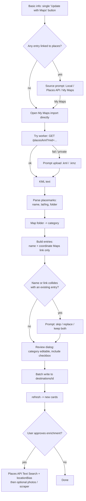

# Import from Google My Maps — Edit Page — Implementation Plan

> **Date:** 2026-08-26
> **Status:** P1–P5 implemented (all phases done 2026-08-26); epic E052 complete — plus post-P5 refinements: expanded folder→category auto-detection (227 aliases) + unmapped-placemark review UX, the My Maps entry point relocated to the basic-information **"Update with Maps"** button (opens directly when nothing is linked; via the My Maps source option otherwise; no per-item or map-section button), and imports into a currently-disabled category auto-enable that category's module (`modules.{cat}: true` written in the same batch). Follow-up fix (2026-08-26): un-enriched placemarks persist a **scraper-friendly `sourceUrl`** (name search centered on the pin) instead of the bare coordinate link, so the bulk "Update with Maps → Local" path can actually resolve them — see §5 P3 + §8.
> **Scope:** Add an **"Import from My Maps"** action to the **edit page**
> (`edit/destination.html`): a button in the **general (first) section** when the
> destination has a `myMaps` link, plus a **My Maps option** as the first step of
> the existing "Import with maps" flow. It pulls My Maps placemarks into the
> destination's category entries, with a per-conflict prompt when a name or Maps
> link collides with an existing entry.
> **Backlog ticket:** `E052 — Import from MyMaps` (epic, in Backlog).

---

## 1. Viability verdict

**Viable — yes, with one hard constraint and two adjustments to the proposed flow.**

| # | Claim | Verdict | Detail |
|---|---|---|---|
| 1 | Fetch `https://www.google.com/maps/d/kml?mid=…&lid=…&forcekml=1` from the browser | ❌ **Not directly** | Verified 2026-08-26: the endpoint returns **no `Access-Control-Allow-Origin`** header → browser `fetch()` is CORS-blocked. A **server-side proxy** is required. |
| 2 | Parse the KML into name + coordinates | ✅ | KML is plain XML; parse with `DOMParser`. KMZ (the My Maps "Export" default) is a ZIP — unzip with the already-vendored **JSZip**. |
| 3 | Get a Place ID from the KML | ❌ **KML has none** | The export only carries `name` + `coordinates` (+ folder). No place id, no address, no description. `query_place_id` must be **resolved**, not read. |
| 4 | `…/maps/search/?api=1&query=<name>&query_place_id=<place_id>` | ✅ (after resolution) | Valid Maps URL — but only usable **after** we resolve a real place id. |
| 5 | `…/maps/search/?api=1&query=<lat>,<lng>` | ✅ | Valid coordinate deep-link; good fallback when no place id resolves. |
| 6 | Feed the result into Places API / gmaps-scraper | ✅ | Both already exist and are reusable (`data/services/places-api.service.ts`, `data/services/gmaps-scraper.service.ts`). |

**Net:** the feature is buildable. The plan below replaces "read place id from KML" with
"import **name + a Maps link first**, then (optionally, on user approval) enrich via Places
API Text Search (with a new location bias) or the local scraper", adds a KML proxy, and
prompts the user whenever a generated name or Maps link collides with an existing entry.

---

## 2. Key facts (grounded in the codebase)

| Area | Current state |
|---|---|
| Data model | `destinations/{id}` doc. Categories `restaurants / snacks / nightlife / tourism / shopping`. Each entry keyed by random id → `DestinationEntry` (`name, map, placeAPI, emoji, description, website, instagram, regions, media, price, rating, images, isNew, createdAt`). `placeAPI.id` = Google Place ID. `myMaps` = My Maps viewer URL (or `""`). |
| Category config | `public/assets/json/destinations-config.json` → `categories.ids`, `translation` (EN), `_deprecated_original` (PT: `restaurantes / lanches / saidas / turismo / lojas`). |
| Edit page — map link | `pages/edit-destination/existing-destination.ts` `loadMapData()` fills the `#map-link` input (the `myMaps` URL) in the map section; `set-destination.ts` `buildDestinationObject()` reads it back on save. |
| Edit page — source step | `places/places-source-step.ts` `getSourceOptionsHTML()` already renders the Local vs Places API choice for "Import with maps" — add a **My Maps** option there. |
| Places API | Cloudflare worker `workers/places-api/`. `GET /places/search?q&lang&photos` → Text Search. **No location bias today** (`places.js` `searchText()` sends only `textQuery`). `GET /places/{id}` → details. `GET /places/{id}/photos`. Frontend is **hard-gated to local envs** (`PLACES_API_ENABLED`). |
| Local scraper | `scripts/gmaps-scraper/server.mjs` `POST /scrape` (Node `:8788`, dev-only). Accepts Maps **URLs and search queries**. Frontend client `gmaps-scraper.service.ts` (`GMAPS_SCRAPER_ENABLED`, local-only). |
| Bulk write | `data/firebase/database.ts` `createBatchOps()` + `update(path, { [\`${category}.${id}\`]: item })` (dot-path key). Reuse for importing many entries. |
| ZIP | `public/assets/vendor/jszip/jszip.min.js` vendored; `declare var JSZip: any;` in `vendor.d.ts`; currently script-included **only on `index.html`**. |
| i18n | `translate()`; language packs `public/assets/json/languages/{en,pt}.json`. |
| Action wiring | `ui/actions.ts` `registerActions` + `data-action="…"` (delegated click). |

---

## 3. Where the proposed flow diverges from reality

1. **`lid` (layer id) is not in the stored `myMaps` URL.** The stored URL is
   `https://www.google.com/maps/d/viewer?mid=<MID>&usp=sharing` (no `lid`). A multi-layer
   map fetched with only `mid&forcekml=1` returns `<NetworkLink>` entries pointing at each
   `…/kml?mid=<MID>&lid=<LAYER_ID>&forcekml=1`, not the placemarks. So the proxy must:
   - fetch `mid&forcekml=1`;
   - if the body contains `<NetworkLink>`, extract each `lid` and fetch those URLs, merging placemarks;
   - otherwise parse the single returned layer directly.

2. **No place id in the export.** Resolution is the core new work (see §5 P3).

3. **Folder names ≠ category ids.** My Maps folders are free text
   (e.g. `Restaurantes`, `Lanches / Brunch`, `Saídas`, `Turismo`, `Compras`, `Hospedagem`,
   `Trabalho`). We map the known ones and let the user assign/reject the rest (§5 P2).

4. **Name / Maps-link collisions are expected.** Chains repeat (`Dunkin'` ×8) and two
   placemarks can resolve to the same Maps link. Before writing, prompt per conflict
   (§5 P4): keep both, skip the new one, or replace the existing entry.

---

## 4. End-to-end flow



---

## 5. Phases

### P0 — Viability checklist (this document)
Done here. Decisions confirmed (see §7) — no open questions remain.

### P1 — KML acquisition (proxy + upload)
- **New worker route** `GET /places/kml?mid=<MID>` (optional `lid`) in
  `workers/places-api/src/index.js`:
  - Reuse `authenticate()` (Firebase token + `canUsePlacesAPI` allowlist) and the rate limiter,
    but **skip the Places quota tracker** (the KML fetch is free — no Google Places API key).
  - Server-side `fetch("https://www.google.com/maps/d/kml?mid=…&forcekml=1")`.
  - Follow `<NetworkLink>` layers when present (parse `lid` hrefs, fetch, concatenate
    `<Placemark>`s into one `<Document>`), else pass through.
  - Return the KML as `application/vnd.google-earth.kml+xml` (or `text/xml`) **with CORS
    headers** (already produced by `buildCorsHeaders`).
  - Add route matching before the existing `segments.length === 2` details branch.
  - **Timeout guard (added 2026-08-26):** Google's KML endpoint can hang (private/slow maps)
    and workerd has no default fetch timeout. `fetchKmlUrl()` now aborts after
    `MYMAPS_FETCH_TIMEOUT_MS` (15 s) and returns a clean **504** so the frontend falls back
    to the upload path instead of spinning on "Fetching your My Maps map…" forever (see
    §8 Risks & gotchas).
- **Frontend client** `data/services/mymaps-kml.service.ts`:
  - `fetchKml({ mid, lid, signal })` → `GET {PLACES_API_BASE_URL}/places/kml?mid=…` with
    `Authorization: Bearer <firebase token>`.
  - **Local-only for now** (decision #2): mirrors the Places API `PLACES_API_ENABLED` gate
    — already shipped in P1.
- **Upload path** — fallback when the worker path fails or the map isn't public (decision #4:
  worker first, upload fallback):
  - `.kml` → `await file.text()`.
  - `.kmz` → load the vendored **JSZip on demand** (script injected only when a `.kmz` is
    picked), then `JSZip.loadAsync(file)` → read `doc.kml` (fallback: first `*.kml` entry).
    On-demand loading keeps `jszip.min.js` out of the static-export manifest (see §8).

### P2 — KML parsing + category mapping ✅ (implemented 2026-08-26)
- **New** `data/services/mymaps-kml.service.ts` (or `pages/edit-destination/support/mymaps-import/parser.ts`):
  - `parseKml(kmlText)` → `{ name, lat, lng, folder }[]` using `DOMParser` +
    `getElementsByTagName('Placemark')`, reading `name` (CDATA-safe), `Point/coordinates`.
  - `mapFolderToCategory(folder)`:
    - normalize (lowercase, strip diacritics);
    - exact/substring match against `destinations-config.json` `translation` (EN) +
      `_deprecated_original` (PT) + an explicit alias table (`compras → shopping`,
      `lanches/brunch → snacks`, `saidas/outings → nightlife`, etc.);
    - unmatched → `null` (goes to the review screen as "unassigned").

> **Post-P5 refinement (2026-08-26):** the alias table was expanded to **227
> entries** — English/PT, plural, generic, and multi-word phrase variants
> (e.g. `Coffee Shop`, `Bars`, `Parks`, `Supermarket`, `Museums`, `Where to
> Eat`, `Barbecue`) so far more layer names auto-map. Matching stays
> normalized-substring with **longest-label-wins** (e.g. `Barbecue` →
> restaurants beats the shorter `bar`; `Lanches / Brunch` → snacks). Anything
> still unmatched returns `null` → the review dialog surfaces it.
- **Entry shape** (before resolution):
  ```ts
  interface MyMapsDraft {
    folder: string;
    category: string | null;   // resolved category id, or null
    name: string;
    lat: number;
    lng: number;
    placeId?: string;          // filled by P3
    map?: string;              // canonical Maps URL
    include: boolean;          // review checkbox
  }
  ```

### P3 — Map-link building (stage 1) + optional enrichment (stage 2) ✅ (implemented 2026-08-26)
Decision #3: **import name + Maps link first**; run Places enrichment only when the user
approves it afterwards.

> **Additive enabler:** the worker now also returns `location: { lat, lng }` on search
> results (added `location` to the field mask + `normalize.js` pass-through, and to
> `models/places-api.model.ts` `PlaceSearchResult`) — required for the stage-2
> nearest-pick. Documented in the backend contract §4.1.

- **Stage 1 (always, no Places calls):**
  - `map = https://www.google.com/maps/search/?api=1&query=<lat>,<lng>` (coordinate deep-link)
    and `placeAPI.id = ''` (entry refreshable by link only).
  - `placeAPI.sourceUrl` is **not** the coordinate link: it's a name search centered on the pin
    (`https://www.google.com/maps/search/<name>@<lat>,<lng>,15z` — see `buildMapsSearchUrl`) so the
    bulk local scraper path can resolve it later; `map` keeps the user-facing coordinate pin.
    Once enrichment resolves a canonical link, `sourceUrl` = that link instead.
  - Persisted fields per entry: `name`, `map`, `placeAPI = { id: '', name, map, … }`,
    `isNew: false`, `createdAt`, `regions: []`, `emoji` from a per-category default.
- **Stage 2 (optional, user-approved enrichment):**
  - **Extend the worker's Text Search with a location bias** (small, high-value change):
    - `workers/places-api/src/index.js` `handleSearch`: accept optional `biasLat`, `biasLng`,
      `biasRadius` (default e.g. 5000 m).
    - `workers/places-api/src/places.js` `searchText()`: add
      `locationBias: { circle: { center: { latitude, longitude }, radius } }` to the request body.
    - `places-api.service.ts` `searchPlaces(q, { bias })` passes them through.
  - **Resolution order** per placemark:
    1. **Places API** (when `PLACES_API_ENABLED`): `q = name` (+ destination `title` appended
       when the hit is far) with `bias` = placemark coords → pick the best result (closest to
       coords, then name-similarity) → `placeId` + `googleMapsUri`.
    2. **Local scraper** (when `GMAPS_SCRAPER_ENABLED` and 1 unavailable): `scrapePlaces([mapUrl])`
       with `mapUrl = buildMapsSearchUrl(name, { lat, lng })` — a **name search centered on the
       placemark coords** (`https://www.google.com/maps/search/<name>@<lat>,<lng>,15z`). Without the
       center bias the scraper returns the top hit for the name alone, mis-picking chains.
    3. **Keep the coordinate link** when neither resolves.
  - **Chain disambiguation** (e.g. `Dunkin'` ×8): location bias is what makes step 1 reliable;
    Text Search bias is a soft ranking, not a hard filter — still pick nearest, and let the
    user correct wrong matches in the review screen.

### P4 — Review + bulk write UI (edit page) ✅ (implemented 2026-08-26)
- **New** `pages/edit-destination/support/mymaps-import.ts` exporting
  `openMymapsImportDialog()` — owns acquire (fetch → upload fallback), review,
  optional enrichment, conflict pass and the batched write.
- **Entry points (decision #1, refined 2026-08-26):** ONE button — the
  basic-information **"Update with Maps"** bulk button (`#places-bulk-btn` inside
  `.places-fetch-wrapper`, moved before the title group; the wrapper now shows
  even when nothing is linked to places):
  - **Nothing linked to places** (`countBulkEligibleEntries() === 0`) → clicking
    opens the My Maps import directly (`openMymapsImportDialog()`), no source prompt.
  - **Something linked** → the source prompt shows Local / Places API / **My Maps**
    (`places-source-mymaps-bulk` closes the prompt and lands in the same review flow).
  - **Per-item imports NEVER show My Maps** (batch operation) —
    `getSourceOptionsHTML()` only renders the My Maps card when the caller passes
    `mymapsAction` (bulk-only). The old per-item `places-source-mymaps` action and
    the map-section `#mymaps-import-btn` were removed.
- **Review dialog** (reuses `utils/messages.ts` `displayFullMessage` + the
  places-dialog container/loading patterns): one row per placemark with
  include checkbox, resolved category `<select>` (defaults to the folder
  mapping), status badge ("coordinate link" / "resolved" / "failed").
  Unassigned-but-checked rows are skipped with an inline hint; the Import
  button label reflects the importable count.
- **Enrichment (decision #3):** optional "Enrich with Places API" button in the
  review (only when a source is enabled) → `resolveMyMapsDrafts()` with a live
  progress line; statuses update in place after resolution.
- **Conflict prompt (decision #5):** before writing, every included draft whose
  `name` or `map` link collides with an existing entry in its target category
  is listed in ONE dialog with a per-item choice (keep both / skip / replace;
  default keep). Cancelling returns to the review dialog.
- **Write**: group drafts by category; ids via `getRandomID({ pool: existing
  ids })`; `createBatchOps()` `batch.update(docRef, { [\`${category}.${id}\`]:
  item })` (dot-path map keys) in chunks of ≤ 500. On success: re-read the doc
  (`getSingleData`), re-populate the form (`populateExistingDestinationForm`),
  reset the unsaved-changes baseline (`snapshotFormState`) and
  `openToast(...)`.

> **Post-implementation change (2026-08-29) — import is now STAGED, not
> written directly.** `writeImports()` → `stageImports()`: the My Maps import no
> longer commits a Firestore batch. It stages into
> `FIRESTORE_DESTINATIONS_NEW_DATA` (entries, auto-enabled `modules`, and the
> `myMapsImported` marker) and adds/refreshes the live edit-form cards
> (`addDestination` + `addDestinationHTML`), matching the Places enrich/refresh
> convention — **the edit page's Save button persists everything**. Supporting
> changes: `buildDestinationObject` now preserves `myMapsImported` (reads
> DATA-or-NEW_DATA) so Save persists the marker; `isMyMapsImported()` reads the
> staged flag too; the post-import step only refreshes the bulk button (no
> re-read, no `snapshotFormState`, so the unsaved-changes prompt still fires);
> the success toast uses the new `mymapsImport.staged` key.

> **Post-P5 refinement (2026-08-26) — unmapped handling:** placemarks whose
> folder didn't auto-map now default to **unchecked** and are grouped under a
> highlighted **"Couldn't map N placemark(s)"** heading at the bottom of the
> review list (theme-tinted rows + "Unassigned" badge). The user can either
> **assign a category** via the `<select>` (which auto-checks the row, so it
> counts toward Import) or **leave it unchecked to discard**. The "N will be
> skipped" hint still appears if a checked row is left without a category.
>
> **Post-P5 polish (2026-08-26) — review dialog UI:** dropped the per-row
> "Coordinate link" status badge (pre-enrichment every placemark is just a
> coordinate pin, so the badge was noise — only "Resolved"/"No match" show
> after enrichment); restyled the category `<select>` to match the app's form
> selects (`appearance: none` + chevron + focus ring); and switched the
> unmapped heading/rows/badge from an ad-hoc orange to theme tokens
> (`--theme-color` / `rgba(var(--theme-color-rgb), …)`), per the
> theme-or-neutral color rule.

### P5 — i18n + styles + build ✅ (implemented 2026-08-26)
- The dialog-critical `mymapsImport.*` keys (button label, dialog title,
  statuses, conflicts, counts, unmapped heading) + `placesApi.source.mymaps*`
  and the review/conflict CSS shipped with P4/P5. A scripted cross-check
  confirmed every key referenced in code exists in BOTH packs (0 missing).
- CSS in `public/assets/css/edit/edit.css` — general-section button, review +
  conflict dialogs, unmapped section/badge.
- Register the action in `ui/actions.ts` and the new module in the
  edit-destination bundle (done — esbuild auto-bundles by import; no new entry
  points needed).

---

## 6. Files

### New
| File | Purpose |
|---|---|
| `public/assets/ts/data/services/mymaps-kml.service.ts` | KML proxy client + `parseKml` + folder→category (P1/P2) |
| `public/assets/ts/pages/edit-destination/support/mymaps-import.ts` | Review + conflict dialog, batch write, action registration |

### Modified
| File | Change |
|---|---|
| `workers/places-api/src/index.js` | Add `GET /places/kml` route (auth + CORS, no Places quota) — **done in P1** |
| `workers/places-api/src/places.js` | `searchText()` optional `locationBias` (P3 stage 2) |
| `workers/places-api/src/index.js` (`handleSearch`) | Accept + validate `biasLat/biasLng/biasRadius` (P3 stage 2) |
| `public/assets/ts/data/services/places-api.service.ts` | `searchPlaces` bias params (P3 stage 2) |
| `public/edit/destination.html` | Single bulk "Update with Maps" button on basic info (before title group); map-section button removed (P4) |
| `public/assets/ts/pages/edit-destination/existing-destination.ts` | Map-section My Maps button logic removed (P4) |
| `public/assets/ts/places/places-source-step.ts` | "My Maps" source option is BULK-ONLY (P4) |
| `public/assets/json/languages/{en,pt}.json` | New `mymapsImport.*` keys (P5; `errors.*` added in P1) |
| `public/assets/css/edit/edit.css` | General-section button + review dialog styles (P5) |

---

## 7. Resolved decisions

1. **Scope** — the **edit page** (`edit/destination.html`), not the viewer. A single
   **"Update with Maps" button** in the **basic-information** section (inside
   `.places-fetch-wrapper`, before the title group): when opened it prompts for
   Local / Places API / **My Maps** (same source-step as the per-item dialog, minus the
   per-item My Maps card); if nothing is linked to places it goes straight to the My Maps
   import. On conflict (generated name or Maps link matches an existing entry), ask the
   user how to proceed. **Refined 2026-08-26:** My Maps is batch-only — no per-item
   option, no separate map-section button.
2. **Local-only for now** — reuse the Places API local-only gate (`PLACES_API_ENABLED`).
3. **Enrichment is a second, optional step** — import name + Maps link first; run Places API
   enrichment only if the user approves.
4. **Worker first, upload as fallback** — try `GET /places/kml`; fall back to file upload when
   the worker fails or the map isn't public.
5. **Conflicts — let the user decide** (warn): per collision offer skip / replace / keep both.

---

## 8. Risks & gotchas

- **CORS on Google KML** (verified): direct browser fetch fails; the proxy is mandatory for
  the link path. Upload path is unaffected.
- **`NetworkLink` layers**: `mid`-only KML can return links, not placemarks; the proxy must
  recurse into `lid`s.
- **Google auth/cookies**: the KML endpoint may 404/redirect for maps that are **not public
  or link-shared**. Private maps fail even server-side — surface a clear error and point the
  user to the upload path.
- **No place id in export**: resolution can mismatch chains (`Dunkin'`); location bias +
  nearest-pick mitigates; the review screen is the safety net.
- **Coordinate-only links can't be scraped**: the stage-1 coordinate deep-link
  (`…/maps/search/?api=1&query=<lat>,<lng>`) carries no business to extract — feeding it to the
  local scraper yields "no place data" or a wrong nearby pin. Mitigated twice: (1) import persists
  a name-search `sourceUrl` (`buildMapsSearchUrl`, centered on the pin) instead of the coordinate
  link; (2) the bulk local path (`places-bulk.ts` `buildScrapeUrlForEntry`) rewrites any remaining
  coordinate-only link into that name search before scraping. Once a real place id resolves,
  `…/search/?api=1&query=<name>&query_place_id=<id>` pins the exact place.
- **Rate limits**: Places Text Search (one call per placemark) and the scraper both rate-limit;
  resolve **sequentially with small concurrency** and let the user review before applying.
- **KMZ is a ZIP**: the service loads the vendored JSZip on demand (only when a `.kmz` is
  picked), so it stays out of the static-export manifest — don't add it as a static
  `<script>` on any page.
- **Edit page isn't statically exported**: `edit/` is excluded from the static-export manifest,
  so the import button doesn't need an `isStaticMode()` guard — but the edit page is
  owner-gated, so the import must only run for the document owner (the page already enforces
  this on save; reuse that gate).
- **Conflict UX**: match conflicts against BOTH `name` and resolved `map` link; show the
  prompt before any write so the user can undo/correct in one pass.
