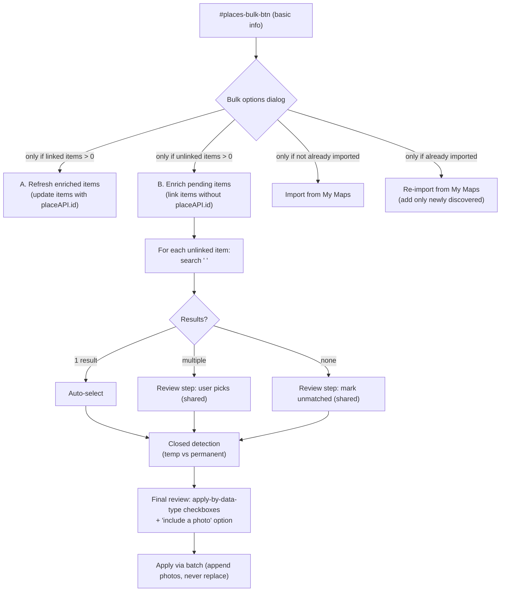

# Maps Import / Enrichment Overhaul

| | |
|---|---|
| **Date** | 2026-08-28 |
| **Status** | Implemented — all phases P0–P9 complete (2026-08-28); open decisions resolved with defaults (see §13) |
| **Scope** | Google Maps / Places API / My Maps / local gmaps-scraper import & enrichment flows on the edit-destination page |
| **Backlog ticket** | ⚔️ `E053` (Epic — kept in README Backlog until all phases complete) |

**Legend used throughout:** ✅ = confirmed requirement from the prompt · 💡 = recommendation (not yet confirmed) · ❓ = open question / investigation item.

---

## 1. Viability verdict

| Claim | Verdict | Detail |
|---|---|---|
| Rename actions/labels | ✅ Viable | Pure i18n key + button-label changes (`placesApi.updateWithMaps`, `placesApi.search.includePhotos`). |
| Restructure the bulk source prompt into "Refresh enriched" / "Enrich pending" | ✅ Viable | The source-option cards already exist (`getSourceOptionsHTML`); new options are new cards + new handlers. |
| Batch-enrich unlinked items via Places search | ✅ Viable | `searchPlaces(q)` + `getPlace(id)` already exist; the per-item search text (`"<entry name> <destination title>"`) is trivially reusable. |
| Multi/no-result review step | ✅ Viable | New step; the per-item dialog already has a search-results list to model from. |
| Temporary vs permanently closed | ✅ Viable (needs normalization) | Worker already surfaces `businessStatus` (`OPERATIONAL` / `CLOSED_TEMPORARILY` / `CLOSED_PERMANENTLY`). Today only `CLOSED_PERMANENTLY` is treated as closed (`buildClosedState`). |
| Final "apply by data type" review (no per-field old/new) | ✅ Viable | Reuses `FIELD_KEYS` groups from `places-apply.ts`; replace the per-field checkboxes with grouped toggles. |
| My Maps import "hide when done" | ⚠️ Viable with new marker | **No "already imported" flag exists today** (verified). Needs a persisted marker (see §5). |
| My Maps re-import (ignore existing, add new) | ⚠️ Viable with identity rule | No stable KML identity is stored; coordinates are recoverable from `placeAPI.sourceUrl` for un-enriched pins but not guaranteed for enriched ones. Needs a decision (§6). |
| My Maps enrichment excludes photos | ✅ Already true / confirm | `buildMyMapsEntry` sets `images: []` and `resolveViaPlacesApi` does not request photos; must confirm and keep it that way. |
| Single-item "Include photo" + `+` + 5-photo cap, append-only | ⚠️ Viable with backend change | **Worker `handlePhotos` returns ≤ 1 photo today**; frontend caps at 3 and **replaces** `entry.images`. Needs worker change + append logic (§8). |
| Local scraper for My Maps links | ❓ Investigate | My Maps coordinate-only `?api=1&query=lat,lng` links do **not** scrape; name-search rewrite exists but reliability for My Maps-generated pins is unproven. |

---

## 2. Key facts (grounded in the codebase)

### 2.1 Entry points today

- **Bulk button** `#places-bulk-btn` sits on the **basic-information** section (`public/edit/destination.html`), wired in `pages/edit-destination/edit-destination.ts` (`loadEventListeners` ≈ L229 → `openPlacesBulkDialog`).
- **Bulk entry** `openPlacesBulkDialog()` (edit-destination.ts ≈ L281):
  - `countBulkEligibleEntries() === 0` → goes **straight** to `openMymapsImportDialog()`.
  - else shows source cards: Local (gmaps scraper) / Via Places API / Import from My Maps.
- **Per-item entry** `openPlacesDialog(category, j)` (`places/places-dialog.ts` ≈ L106). Steps: `source → local → linked → search → details → photos → closed → done`.
  - Local dev (`GMAPS_SCRAPER_ENABLED`) starts at `source`; else `linked` (has `placeAPI.id`) or `search`.

### 2.2 What "linked" / "unlinked" / "scrapeable" mean (bulk)

All in `places/places-bulk.ts`:

- `collectLinkedEntries()` → entries with `placeAPI.id` (a Google Place ID).
- `collectLocalScrapeEntries()` → entries with `placeAPI.sourceUrl` or `placeAPI.map`.
- `countBulkEligibleEntries()` → union of the two (drives button visibility).
- `countLinkedItems()` → linked-only count.
- Bulk Places refresh = `runBulkPlacesUpdate()` → `getPlace(id, { photos: false })`, concurrency 5, compares fresh vs saved `placeAPI`, renders a report with apply options, persists via batch dot-path updates.

### 2.3 Per-item search text

`places/places-search-step.ts` `renderSearchStep`:

```ts
const initialQuery = context.entryName
    ? `${context.entryName} ${context.destinationTitle}`.trim()
    : '';
```

i.e. **`"<entry name> <destination title>"`**. This is the exact text the prompt says to reuse for batch enrichment.

### 2.4 Apply / merge semantics

`places/places-apply.ts`:

- `FIELD_KEYS = ['name','website','rating','price','description','emoji','map','region','instagram']`.
- `applyPlaceData()` always merges fresh info into `entry.placeAPI` (`mergePlaceAPI`), then applies **only checked fields** to the entry.
- `mergePlaceAPI` preserves `previous.sourceUrl` and `previous.closed` via spread, and writes `id: newPlace.id ?? ''`.
- `region` maps to `entry.regions[]` (append, never wipe); primitives copy only when non-empty.

### 2.5 Closed places

`places/places-apply.ts` `buildClosedState` (≈ L229):

```ts
// Per plan Open Question 8, only CLOSED_PERMANENTLY counts for now;
// CLOSED_TEMPORARILY is not treated as closed.
return { closed: status === 'CLOSED_PERMANENTLY', status };
```

Worker `normalize.js` emits `businessStatus` **only when present** (`OPERATIONAL` / `CLOSED_TEMPORARILY` / `CLOSED_PERMANENTLY`).

### 2.6 Photos

- Search step toggle: `placesApi.search.includePhotos` = **"Include photos"** (default unchecked) → passes `photos: includePhotos` to `searchPlaces`.
- Photos step (`places/places-closed-photos-step.ts`): `placesApi.photos.import` = **"Import photos"** (default checked) → `getPlacePhotos(id)`; `MAX_PHOTOS = 3` frontend.
- **Worker `handlePhotos` returns `raw.photos.slice(0, 1)` — at most 1 photo** (`workers/places-api/src/index.js` ≈ L270). This contradicts the frontend cap of 3.
- Apply (`places-apply-flow.ts` `applyAndClose` ≈ L150): `entry.images = photosToApply` — **replaces** the existing `images` array.
- There is **no 5-photo cap anywhere** in the code today.

### 2.7 My Maps import

`pages/edit-destination/support/mymaps-import.ts` `openMymapsImportDialog()` (≈ L87):

1. Read `#map-link` (destination `myMaps` URL) → `extractMid()` → `fetchKml({ mid })` via worker `GET /places/kml?mid`; fallback to `.kml`/`.kmz` upload.
2. `parseKml()` (`data/services/mymaps-kml.service.ts` ≈ L180) → per `<Placemark>`: `name`, `<Point><coordinates>` (lng,lat), nearest `<Folder>` → `mapFolderToCategory`.
3. Review dialog (include checkbox + category select + status).
4. Optional "Enrich with Places API" → `resolveMyMapsDrafts()` (concurrency 3) → `resolveViaPlacesApi` (Text Search with location bias) → `resolveViaScraper` fallback → coordinate link.
5. Conflict pass (name or Maps-link collision).
6. `writeImports()` → dot-path updates `{category}.{id}`, auto-enables category modules, re-reads + repopulates.

`buildMyMapsEntry(draft)` (mymaps-kml.service.ts ≈ L620) writes:
- `map` = canonical link if resolved, else coordinate deep-link `https://www.google.com/maps/search/?api=1&query=<lat>,<lng>`.
- `placeAPI.sourceUrl` = canonical link if resolved, else the coordinate search URL.
- `placeAPI.id` = real Place ID **only if enriched**, else `''`.
- `images: []` — **no photos** (already matches requirement #4, but must be confirmed/enforced).

### 2.8 Real trip data (destination `fqTWp4Hkrg6Iecoz2zDr`)

Verified in the local emulator. This is a **destination document** (not a trip doc) whose entries came from a My Maps import:

- Un-enriched pins: `map` + `placeAPI.sourceUrl` = `https://www.google.com/maps/search/?api=1&query=<lat>,<lng>`; `placeAPI.id = ""`; `createdAt` all identical (import timestamp); `isNew: false`.
- Enriched pins: `placeAPI.id = "ChIJ…"`, `map` became a canonical `https://maps.google.com/?cid=…` link, **but `placeAPI.sourceUrl` still holds the coordinate search URL** (spread-preserved by `mergePlaceAPI`).
- Some entries carry `images` (1–2 photos) after single-item enrichment.
- Observed bug: one `placeAPI.description.en` = `"[object Object]"` (Kravitz) — a latent object-vs-string description bug worth fixing opportunistically.

### 2.9 i18n

- `public/assets/json/languages/en.json` (and `pt.json`, parallel):
  - `placesApi.updateWithMaps` = `"Update with Maps"` (L982)
  - `placesApi.fetchInfo` = `"Fetch Info With Maps"` (button label when not linked)
  - `placesApi.search.includePhotos` = `"Include photos"` (L1009)
  - `placesApi.photos.import` = `"Import photos"`, `photos.canImport`, `photos.count`, `photos.none`
  - `placesApi.closed.*`, `placesApi.bulk.*`, `placesApi.source.*` (Local/API/My Maps cards)
  - `mymapsImport.*` (L1098)
- Styling: theme vars in `public/assets/css/base/variables.css` (`--theme-color*`, `--bg-*`, `--text-*`, `--border-color`, `--box-color*`, `--radius-*`, `--shadow-*`); edit-page + dialogs styled in `public/assets/css/edit/edit.css` (`places-dialog*`, `places-bulk*`, `mymaps-dialog*`). There is no `--neutral-*` family — neutrals use `--bg-*`/`--text-*`/`--border-color`.

---

## 3. Where the proposal diverges from reality

1. **"5-photo cap already exists"** — it does not. API photos cap at 3 (frontend) / 1 (worker), scraper is uncapped. The 5-photo cap is **new** work.
2. **"My Maps import already tracks completion"** — it does not. No flag anywhere; only the `myMaps` URL field + the imported entries themselves.
3. **"Batch refresh already distinguishes closed vs temporary"** — it only flags `CLOSED_PERMANENTLY`; `CLOSED_TEMPORARILY` is silently ignored.
4. **"Photos are appended"** — today single-item photo apply **replaces** `entry.images`.
5. **"Worker returns up to 3 photos"** — it returns **1** today (likely regression vs. earlier intent).
6. **`export-maps-data.py`** is legacy/standalone (direct Google API, stale `moedas.json` path) and is **not** part of the runtime flow — out of scope, do not route this work through it.

---

## 4. End-to-end flow (proposed)



Per-item dialog (requirement #6) is a **separate** flow — the existing `places-dialog.ts` steps, with the photo step reworked (§8).

---

## 5. Proposed UX / navigation

### 5.1 Bulk options (replaces the current source prompt on `#places-bulk-btn`)

| Option | Visibility condition | Recommended label | Recommended sublabel |
|---|---|---|---|
| A. Refresh enriched | `countLinkedItems() > 0` | ✅ "Refresh enriched items" (keep) — 💡 alt: "Update linked places" | 💡 "Update the N items already linked to Google Places" |
| B. Enrich pending | `countUnlinkedItems() > 0` (new helper) | ✅ "Enrich pending items" (keep) — 💡 alt: "Link unlinked items" | 💡 "Link the N items without a place" (💡 prefer "link/enrich" over "update" — "update" implies refreshing existing data, not linking) |
| Import from My Maps | `!myMapsImported` (new marker) | ✅ keep "Import from My Maps" | existing |
| Re-import from My Maps | `myMapsImported` | ✅ "Re-import from My Maps" | 💡 "Add only newly discovered places" |

- The My Maps cards should **not** both show at once: exactly one shows based on `myMapsImported`.
- If **all** four are hidden, the button hides (or shows a single disabled state) — ❓ decide behavior.
- The current shortcut "0 eligible → open My Maps import directly" should be replaced by the normal options dialog with visibility conditions (so "Re-import" can appear when appropriate).

### 5.2 Batch "Enrich pending items" (B) — detailed flow

1. **Collect** unlinked items: entries across the 5 categories where `placeAPI.id` is empty/absent. ❓ Define: exclude entries with no name? (an item needs a name to search).
2. **Search** each with `"<entry name> <destination title>"` via `searchPlaces(q, { photos:false, bias? })`. 💡 Use the My Maps-style location bias when the item has coordinates (from `sourceUrl`/`map`) — improves accuracy. ❓ Confirm whether to bias, and whether to bias for non-My-Maps items.
3. **Route results**:
   - **1 result** → auto-select (no prompt).
   - **Multiple results** → shared review step; user selects one (or "skip").
   - **No results** → shared review step; item shown as "could not be matched".
   - Multiple + no-result cases live in the **same** review step/screen.
4. **Closed detection** (see §7) applied to each resolved candidate.
5. **Final review** (see §5.3).

### 5.3 Final review (batch apply)

- Do **not** render every old/new value per field.
- Show checkboxes grouped by **data type** to update/replace, e.g.: 💡 `Basic info (name, emoji)` / `Contact & links (website, Instagram, Maps)` / `Ratings & price` / `Description` / `Region` — each mapping to a subset of `FIELD_KEYS`.
- Plus an **"Include a photo"** toggle (batch: fetch 1 photo per matched item; append, cap 5).
- Then apply via the existing batch persistence pattern (`createBatchOps` dot-path updates).

### 5.4 Per-item dialog

- Button label when linked: ✅ `"Enrich Data"` (was `"Update with Maps"`).
- Button label when not linked: 💡 keep `"Fetch Info With Maps"` or align to `"Enrich with Maps"` — ❓ (prompt only renamed the linked label; confirm the unlinked one).
- Photo step reworked per §8.

---

## 6. My Maps import vs re-import

### 6.1 Hide "Import from My Maps" once done

✅ Requirement: hide after the trip/destination has completed a My Maps import.

💡 Recommended: add a persisted marker on the **destination document**, e.g. `myMapsImported: true` (or a `mymaps` metadata object `{ importedAt, count }`). Set it at the end of a successful `writeImports()`. A migration is **not** required for new imports, but existing destinations would default to "not imported" — ❓ decide whether to backfill via a migration (inspect existing `myMaps` field + presence of `sourceUrl` entries to infer).

💡 Alternative without a schema change: infer "already imported" by the presence of ≥1 entry with a coordinate-style `sourceUrl`/`map` — but this is heuristic (a destination could have a scraper import without My Maps). Not recommended as the primary signal; the explicit flag is more reliable.

### 6.2 Re-import: identify already-imported My Maps items

✅ Requirement: items already imported previously are ignored; only newly discovered items are added.

Reliable identity must be based on the current data structure. Facts:

- KML placemarks carry `name` + `(lat,lng)`. No stable KML id is stored today.
- Imported entries store coordinates in `placeAPI.sourceUrl` (coordinate search URL) and/or `map` (coordinate deep-link) — **until** enrichment rewrites `map` to a canonical link. `sourceUrl` is preserved across enrichment (spread), so **coordinates usually survive**.
- Name alone is not reliable (duplicates exist — two "Arby's" in the sample trip).

💡 Recommended matching (primary): parse `lat,lng` from the new placemark and compare against coordinates recovered from existing entries' `sourceUrl` (then `map`) via `parseCoordinateSearchUrl`-style parsing. A coordinate match (within a small tolerance) ⇒ already imported.

💡 Recommended hardening (future imports): at import time, persist an explicit source-coordinate field on the entry (e.g. `placeAPI.sourceCoords = { lat, lng }` or an entry-level `mymaps: { lat, lng }`), so re-import matching no longer depends on URL parsing. Legacy entries fall back to URL parsing.

❓ Open: tolerance for coordinate equality (exact vs ~10–20 m). ❓ Open: what if a placemark was imported but the user later deleted it — should re-import re-add it? (Recommendation: yes, since "already imported" keys off current entries.)

### 6.3 Re-import flow

Same as import (KML acquire → parse → folder/category), but:

- Build the set of already-imported identities (from §6.2).
- **Filter out** placemarks that match existing entries.
- Show review only for **new** placemarks.
- `writeImports()` adds only the new entries (no conflict pass against skipped duplicates).

---

## 7. Closed places (temporary vs permanent)

✅ Requirements:

- Detect and clearly indicate **both** `CLOSED_TEMPORARILY` and `CLOSED_PERMANENTLY`.
- Treat them **separately**.
- For **permanently closed**: provide a checkbox for whether the corresponding TripViewer item should be **deleted**; do **not** auto-delete.

Changes needed:

- `buildClosedState` must stop ignoring `CLOSED_TEMPORARILY` — return a tri-state (`'operational' | 'temporarilyClosed' | 'permanentlyClosed'`).
- Add i18n labels for "Temporarily closed" (distinct from the existing `[Closed]`/delete semantics) and a "Permanently closed — delete item?" checkbox.
- In the batch review and the per-item `closed` step, render the two states differently; only permanent shows the delete checkbox.
- 💡 Recommendation: temporarily closed → show an informational badge, allow the item to be enriched normally (no delete option).

❓ Open: should "temporarily closed" write anything to the entry (e.g. `placeAPI.closed` flag / a label)? Current `getClosedLabel()` adds `[Closed]` to the name. Confirm desired treatment for temporary.

---

## 8. Photo behavior and limits (single-item "Enrich Data")

### 8.1 Labels

- ✅ Rename `placesApi.search.includePhotos` `"Include photos"` → **`"Include photo"`** (singular).
- 💡 The photos-step `"Import photos"` label may stay; ❓ confirm whether it should also read "Import photo" for consistency.

### 8.2 Rules

- ✅ Start with **one** photo.
- ✅ A `+` button/icon adds another photo.
- ✅ Total limit **5 photos per item**.
- ✅ Additional importable photos = `5 - existingPhotos`:
  - 0 existing → up to 5 imported
  - 2 existing → up to 3
  - 4 existing → 1
  - 5 existing → **do not show** the "Include photo" option at all.
- ✅ Existing photos are **never replaced**; imported photos are **appended** up to 5.

### 8.3 Implementation impact

- **Worker** (`workers/places-api/src/index.js` `handlePhotos`): change `slice(0,1)` to support requesting N photos (❓ add a `count` param, default 1, cap e.g. 5; respect the paid photos key + `quota.js`). This is a prerequisite for the `+` button.
- **Frontend photo step** (`places-closed-photos-step.ts`): drop `MAX_PHOTOS = 3` in favor of the 5-cap; compute the remaining capacity from `entry.images?.length ?? 0`; `+` triggers an additional fetch (💡 fetch one more each click rather than all 5, to keep the paid photos quota low).
- **Apply** (`places-apply-flow.ts`): change `entry.images = photosToApply` to **append + dedupe + cap 5**:
  ```ts
  entry.images = dedupeByLink([...(entry.images ?? []), ...selected]).slice(0, 5);
  ```
- **Hide the option** when `(entry.images?.length ?? 0) >= 5`.

---

## 9. Local scraper fit (❓ investigate before implementing)

✅ Confirmed: for **normal Google Maps links**, the scraper can reuse the same "pending items" (unlinked) logic — `scrapePlaces([url])` already powers `runBulkLocalUpdate()` and the per-item `local` step.

❓ Open / to investigate:

1. **Can My Maps-generated links be scraped reliably?** My Maps pins are coordinate-only (`?api=1&query=lat,lng`) and **do not scrape** per `scripts/gmaps-scraper/README.md`. The existing workaround rewrites them to a name search (`buildMapsSearchUrl(name, coords)`), but correctness is unproven for My Maps pins.
2. **Is the name-search rewrite reliable enough** to auto-enrich, or must every rewritten pin go through the manual review step? Recommendation: always route scraper-derived matches through the shared review step (never auto-select), because the scraper's top hit for a name search may differ from the pinned place.
3. **Does the scraper return `businessStatus`** for closed detection? (The scraper's `normalizeRecord` returns `businessStatus`; confirm it's populated for closed places and matches the Places API values.)
4. **Coordinate identity reuse**: if the scraper runs on a My Maps coordinate link, does the result carry coordinates we can persist for re-import matching (§6.2)? Likely only via `sourceUrl`.
5. **Rate limits / concurrency**: local scraper runs at concurrency 1 today (Docker per language). Batch-enriching many unlinked items through the scraper will be slow — ❓ decide whether scraper-enrich is a separate opt-in path or falls back only when the Places API has no result.

---

## 10. Phases (suggested order)

- **P0 — Labels & renames (no behavior change).** Rename `updateWithMaps` → "Enrich Data"; `includePhotos` → "Include photo". Add any new i18n keys. Update `en.json`/`pt.json`.
- **P1 — Bulk options restructure.** New `openPlacesBulkDialog()` rendering A/B/My Maps/Re-import cards with visibility conditions + counts. Add `countUnlinkedItems()` helper. Replace the "0 eligible → My Maps" shortcut.
- **P2 — Refresh enriched items (A).** Essentially the existing `runBulkPlacesUpdate()` with the new label/sublabel; ensure it only shows when linked items exist. No new fetch logic.
- **P3 — Enrich pending items (B) + review steps.** New search/matching module; single/multiple/no-result handling in one review step; closed detection (P4); final apply-by-data-type review; apply via batch.
- **P4 — Closed places tri-state.** Extend `buildClosedState` + i18n + UI for temporary vs permanent; delete checkbox for permanent only.
- **P5 — My Maps import visibility + completion marker.** Add `myMapsImported` (or equivalent) on the destination doc; set on import; gate the Import card. ❓ Decide backfill strategy.
- **P6 — My Maps re-import.** Identity computation (§6.2) + filter + add-only write.
- **P7 — My Maps enrichment photo exclusion.** Confirm `resolveViaPlacesApi` never requests photos and `buildMyMapsEntry` keeps `images: []`; add a guard/comment + test.
- **P8 — Single-item photo rework.** Worker `count` support; photo-step `+` + 5-cap; append-only apply; hide option at 5 existing photos.
- **P9 — Local scraper integration.** Only after §9 investigation items are answered. Wire unlinked-item scrape path behind the shared review step.

> Dependencies: P0 independent; P1 depends on P0; P3/P4 tightly coupled (build together); P5 before P6; P8 independent; P9 last (blocked on investigation).

---

## 11. Files

### New

- `public/assets/ts/places/places-pending.ts` — batch "enrich pending" collection, search orchestration, review-state (P3).
- (If warranted) `public/assets/ts/places/places-bulk-review.ts` — shared final apply-by-type review UI (P3).
- `docs/analysis/20260828-mymaps-reimport-identity.md` (optional) — findings from §9 investigation.

### Modified

- `public/assets/ts/pages/edit-destination/edit-destination.ts` — bulk dialog restructure, visibility, new actions (P1).
- `public/assets/ts/pages/edit-destination/new-destination.ts` + `existing-destination.ts` — button label (`Enrich Data`), hide photo option at 5 photos (P0/P8).
- `public/assets/ts/places/places-bulk.ts` — `countUnlinkedItems`, reuse for A, wire B (P1/P3).
- `public/assets/ts/places/places-apply.ts` — tri-state closed (`buildClosedState`), grouped field apply helpers (P4).
- `public/assets/ts/places/places-apply-flow.ts` — append-only photos, closed tri-state apply (P4/P8).
- `public/assets/ts/places/places-search-step.ts` — "Include photo" label + hide-at-5 (P0/P8).
- `public/assets/ts/places/places-closed-photos-step.ts` — `+` button, 5-cap, single-photo start (P8).
- `public/assets/ts/places/places-details-step.ts` — closed tri-state rendering (P4).
- `public/assets/ts/pages/edit-destination/support/mymaps-import.ts` — set completion marker, re-import entry (P5/P6).
- `public/assets/ts/data/services/mymaps-kml.service.ts` — identity extraction, re-import filter, source-coords persistence (P6/P7).
- `public/assets/ts/models/schema.ts` — `myMapsImported` / source-coords field types (P5/P6).
- `public/assets/ts/models/places-api.model.ts` — photo `count`/tri-state status types (P4/P8).
- `workers/places-api/src/index.js` — `handlePhotos` count support (P8).
- `workers/places-api/src/places.js` / `normalize.js` — photo count + status normalization if needed (P8/P4).
- `public/assets/json/languages/en.json` + `pt.json` — all new/renamed keys (all phases).
- `public/assets/css/edit/edit.css` — new/review/photo steps; **concise, theme + neutral colors only** (see §12).
- `docs/database/destination-document-structure.md` — document new marker fields (P5/P6).

---

## 12. Styling guidance

Per the prompt: keep styling **concise** and reuse existing patterns; use only the **theme color** and **neutral** variables.

- Theme: `--theme-color`, `--theme-color-hover`, `--theme-secondary`.
- Neutrals: `--bg-primary/secondary/tertiary`, `--text-primary/secondary/muted`, `--border-color`, `--box-color`.
- Radii/shadows/transitions: `--radius-md`, `--shadow-sm/md`, `--transition-fast/normal`.
- No new colors; no hardcoded hex. New UI (review cards, `+` photo button, tri-state badges) should extend existing `.places-*` / `.mymaps-*` classes rather than invent new component families.

---

## 13. Resolved decisions (defaults adopted 2026-08-28)

> These were the prompt's open questions. Recommended defaults were adopted on 2026-08-28 because the user was unavailable to answer; **all should be reviewed** when implementation starts. Each is explained in plain language with its resolution.

1. **Items with no name** → **Resolved: skip name-less items silently.** They can't be searched by name, so exclude them from "enrich pending" and don't count them as failures.
2. **Use coordinates to aim the search** → **Resolved: yes, bias by coordinates whenever an item has them** (parseable from `sourceUrl`/`map`), falling back to name + destination title only.
3. **"Temporarily closed" handling** → **Resolved: badge only.** Show a "Temporarily closed" indicator in review; never auto-alter the item. Permanently closed keeps the delete-checkbox behavior.
4. **Button label for items with no Google link yet** → **Resolved: keep "Fetch Info With Maps".** Only the linked label changes to "Enrich Data".
5. **Old My Maps destinations (backfill)** → **Resolved: no migration.** Existing destinations default to "not imported" (they simply show "Import from My Maps" again — harmless).
6. **Coordinate matching for re-import** → **Resolved: ~20 m tolerance; re-add deleted pins.** "Already imported" keys off current entries, so a pin deleted from the destination is treated as new.
7. **Photo "+" fetching** → **Resolved: one more photo per click** (keeps the paid photos quota low). Worker gets a `count` param, default 1, capped at 5.
8. **Local scraper matches must be confirmed** → **Resolved: always confirm.** Scraper-derived matches always go to the review screen; never auto-select.
9. **Batch "include a photo"** → **Resolved: 1 photo per matched item**, including auto-matched ones; append + cap 5.
10. **Empty bulk button** → **Resolved: hide the button** when there is nothing to refresh, enrich, or import.

---

## 14. Risks & gotchas

- **Paid photos quota**: every added photo hits `PLACES_PHOTOS_API_KEY`. The `+`-one-at-a-time approach and `count` default of 1 keep spend bounded; `quota.js` degrade/`limited` toasts must still fire.
- **Worker/frontend photo mismatch**: fix `handlePhotos` returning 1 before the `+` UI, or the button will appear broken.
- **Description `"[object Object]"` bug** (seen in `fqTWp4Hkrg6Iecoz2zDr`): any work touching `placeAPI.description` should fix/guard object-vs-string coalescing (`resolveDescription`).
- **Coordinate loss**: enriched entries lose coordinates in `map`; rely on `sourceUrl` (or add `sourceCoords`) for re-import identity — do not assume `map` stays parseable.
- **Rate limits**: Places search for N unlinked items should use bounded concurrency (existing pattern: 5); scraper path must stay concurrency 1.
- **Batch apply atomicity**: reuse `createBatchOps` (≤500) pattern; dot-path writes must not clobber untouched fields.
- **Local-only gates**: all features are `PLACES_API_ENABLED`/`GMAPS_SCRAPER_ENABLED`-gated; new flows must keep the same hard checks (and never touch PRD data).

---

## Backlog

Completed — tracked as ⚔️ `E053` (Maps import/enrichment overhaul). Per the user's decision (2026-08-28), the epic stayed in **Backlog** until **all** phases (P0–P9) were finished, then moved to `## Done` as a whole (sub-tasks `M218`–`M225`, `F199`, `F200`). See the `backlog-management` skill.
